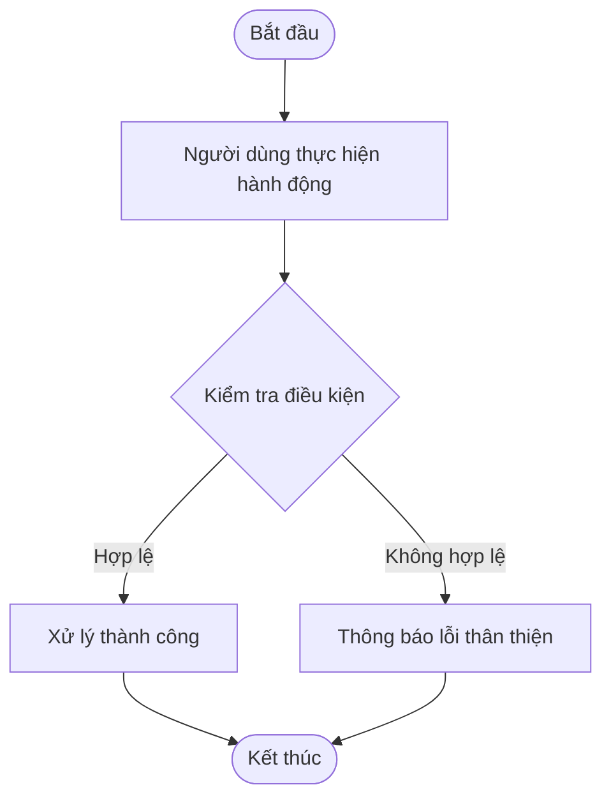
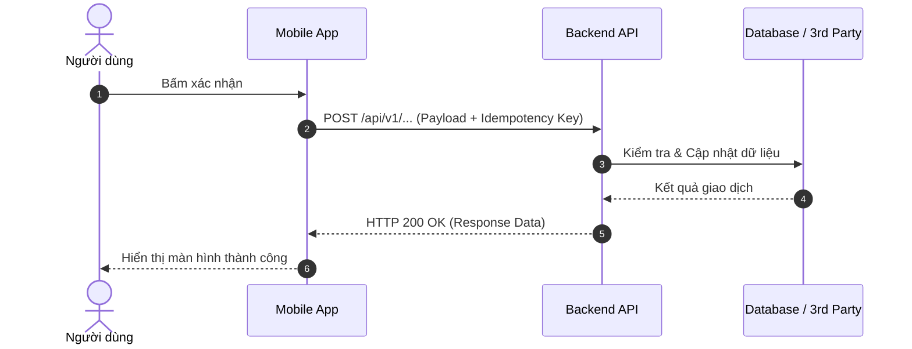

# [PHASE 3] Phân Tích & Đặc Tả Giải Pháp (Analysis & Modeling)

**Initiative Name:** `{{INITIATIVE_NAME}}`  
**Date:** `{{DATE}}`  
**BABOK Knowledge Area:** Requirements Analysis and Design Definition (RADD)  

---

## 1. Sơ Đồ Luồng Nghiệp Vụ (Process Modeling via Mermaid)

### 1.1. Luồng Chính (Happy Path Flowchart)


### 1.2. Luồng Tương Tác Hệ Thống (Sequence Diagram)


---

## 2. Epics & User Stories (Chuẩn INVEST)

### Epic 1: `[Tên Epic chính]`

#### Story 1.1: `[Tiêu đề User Story]`
- **Mô tả:**
  - **Là một (As a):** `[Loại người dùng / Persona]`
  - **Tôi muốn (I want to):** `[Hành động cụ thể]`
  - **Để (So that):** `[Giá trị hoặc lợi ích nhận được]`
- **Độ phức tạp dự kiến (Story Points):** `[1, 2, 3, 5, 8]`
- **Mức độ ưu tiên (MoSCoW):** `[Must Have / Should Have / Could Have / Won't Have]`

---

## 3. Tiêu Chí Chấp Nhận Chi Tiết (Acceptance Criteria - Gherkin)

### Scenario 1: Thực hiện thành công (Happy Path)
```gherkin
Given Người dùng đã đăng nhập vào hệ thống
  And Tài khoản có số dư khả dụng >= 50,000 VND
 When Người dùng nhấn nút "Xác nhận thanh toán"
 Then Hệ thống trừ tiền tài khoản đúng số tiền 50,000 VND
  And Hiển thị màn hình thông báo giao dịch thành công trong vòng 1 giây
  And Gửi thông báo Push Notification xác nhận đến thiết bị của người dùng
```

### Scenario 2: Xử lý ngoại lệ / Số dư không đủ (Negative Path)
```gherkin
Given Người dùng đang ở màn hình thanh toán
  And Số dư tài khoản < 50,000 VND
 When Người dùng nhấn nút "Xác nhận thanh toán"
 Then Hệ thống không tạo giao dịch trừ tiền
  And Hiển thị thông báo: "Số dư không đủ. Vui lòng nạp thêm tiền" kèm nút "Nạp tiền ngay"
```

### Scenario 3: Xử lý tình huống cực đoan / Thought Experiment (Edge Case)
```gherkin
Given Người dùng nhấn nút "Xác nhận" liên tục nhiều lần trong 1 giây (Spam click)
 When Request đầu tiên đang được xử lý ở backend
 Then Hệ thống vô hiệu hoá nút bấm (Disable UI button) ngay lập tức
  And Backend áp dụng Idempotency Key, chỉ xử lý duy nhất 1 giao dịch
  And Không bị trừ tiền trùng lặp (No double-deduction)
```

---

## 4. Từ Điển Dữ Liệu & Ràng Buộc (Data Dictionary)

| Trường dữ liệu (Field Name) | Kiểu dữ liệu (Data Type) | Ràng buộc (Validation Rule) | Bắt buộc (Required) | Diễn giải ý nghĩa |
| :--- | :--- | :--- | :---: | :--- |
| `transaction_id` | UUID string | Format UUID v4 chuẩn | Có | Mã định danh duy nhất của giao dịch |
| `amount` | Decimal(15, 2) | > 0 và <= 50,000,000 | Có | Số tiền giao dịch (VND) |
| `status` | Enum string | `['PENDING', 'SUCCESS', 'FAILED']` | Có | Trạng thái xử lý |
| `created_at` | Timestamp ISO8601 | UTC timezone | Có | Thời điểm khởi tạo |

---

## 5. Đặc Tả Hợp Đồng API (API Contract Specification)

### Endpoint: `POST /api/v1/transactions`
- **Mô tả:** Khởi tạo giao dịch thanh toán.
- **Headers:**
  - `Authorization: Bearer <JWT_TOKEN>`
  - `X-Idempotency-Key: <UUID>`
  - `Content-Type: application/json`

#### Request Payload:
```json
{
  "user_id": "usr_89234812",
  "amount": 100000,
  "currency": "VND",
  "category": "CASHBACK_REWARD",
  "reference_order_id": "ord_99412"
}
```

#### Response (HTTP 200 OK):
```json
{
  "code": "SUCCESS",
  "message": "Transaction processed successfully",
  "data": {
    "transaction_id": "tx_471928419",
    "status": "SUCCESS",
    "cashback_awarded": 5000,
    "new_balance": 155000,
    "processed_at": "2026-09-13T00:15:00Z"
  }
}
```

#### Error Response (HTTP 400 Bad Request):
```json
{
  "code": "INSUFFICIENT_BALANCE",
  "message": "Tài khoản của bạn không đủ số dư để thực hiện giao dịch này.",
  "details": {
    "current_balance": 20000,
    "required_amount": 100000
  }
}
```
