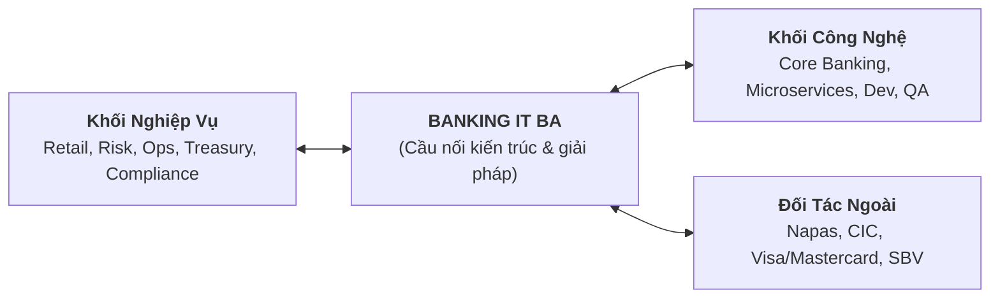

# [TIER 1 - BÀI 1] Tổng Quan Về Nghề Business Analyst Trong Ngân Hàng & Khung BABOK v3

**Mục tiêu bài học:** Nắm vững vai trò đặc thù của IT BA trong các tổ chức tài chính/ngân hàng, cấu trúc 6 vùng tri thức BABOK v3, và cách áp dụng vào môi trường Agile/Scrum của Ngân hàng số (Digital Banking Squad).

---

## 1. Vai Trò Của IT Business Analyst Trong Ngân Hàng

Ngân hàng là ngành có tính **rủi ro cao (High Risk)**, **ràng buộc pháp lý nghiêm ngặt (Strict Regulatory Compliance)** và **hạ tầng công nghệ phức tạp kết hợp giữa Legacy Core Banking và Modern Cloud Microservices**.

Do đó, một **Banking IT BA** không chỉ đơn thuần là người "dịch yêu cầu" (Translator) mà là **Cầu Nối Chiến Lược** giữa 3 khối:
1. **Khối Nghiệp Vụ (Business Units):** Khối Bán lẻ (Retail Banking), Khối Khách hàng doanh nghiệp (Wholesale/SME), Khối Quản trị rủi ro (Risk Management), Khối Vận hành (Operations), Khối Tài chính Kế toán (Finance/Treasury), Phòng Pháp chế & Tuân thủ (Compliance).
2. **Khối Công Nghệ (IT / Engineering):** Solution Architects, Tech Leads, Core Banking Engineers, Backend/Frontend Developers, Data Engineers, Security & DevSecOps.
3. **Đối Tác & Cơ Quan Quản Lý Bên Ngoài:** Ngân hàng Nhà nước (SBV), Trung tâm Thông tin Tín dụng (CIC), Công ty Cổ phần Thanh toán Quốc gia (Napas), Cổng thanh toán, Tổ chức thẻ quốc tế (Visa, Mastercard, JCB).

---

## 2. Bản Đồ 6 Vùng Tri Thức BABOK v3 Áp Dụng Cho Dự Án Ngân Hàng

Khung chuẩn quốc tế **BABOK v3 (Business Analysis Body of Knowledge)** của IIBA được áp dụng như sau:

| Vùng Tri Thức (Knowledge Area) | Nhiệm Vụ Của Banking BA | Ví Dụ Thực Tế Trong Ngân Hàng |
| :--- | :--- | :--- |
| **1. Business Analysis Planning & Monitoring** | Lập kế hoạch phân tích, xác định các bên liên quan (RACI), lựa chọn phương pháp triển khai (Scrum Squad hay Hybrid Waterfall). | Phân bổ sprint cho dự án nâng cấp tính năng Chuyển tiền quốc tế trên App Mobile Banking. |
| **2. Elicitation & Collaboration** | Phỏng vấn chuyên sâu, workshop với các phòng ban, giải quyết mâu thuẫn giữa Trải nghiệm người dùng (UX) và Tiêu chuẩn an toàn bảo mật. | Làm việc với Phòng Quản lý rủi ro gian lận về ngưỡng kích hoạt xác thực sinh trắc học khuôn mặt theo Quyết định 2345/QĐ-NHNN. |
| **3. Requirements Life Cycle Management** | Quản lý vòng đời yêu cầu, đánh giá tác động thay đổi (Change Request - CR), duy trì ma trận truy vết yêu cầu (Traceability Matrix). | Đánh giá tác động khi Ngân hàng Nhà nước thay đổi quy định về tỷ lệ an toàn vốn hoặc trần lãi suất huy động tiền gửi. |
| **4. Strategy Analysis** | Phân tích hiện trạng (AS-IS), xác định khoảng trống (Gap Analysis), định hình trạng thái tương lai (TO-BE), phân tích tính khả thi và rủi ro. | Đánh giá bài toán thay thế hệ thống Core Banking cũ bằng kiến trúc Microservices hiện đại (Decoupling Core). |
| **5. Requirements Analysis & Design Definition (RADD)** | Mô hình hoá quy trình nghiệp vụ (BPMN), viết User Stories, đặc tả tiêu chuẩn nghiệm thu (Gherkin AC), thiết kế Data Dictionary và API contract. | Thiết kế luồng mở thẻ tín dụng phi vật lý tức thì (Virtual Card Issuance) trên ứng dụng Mobile. |
| **6. Solution Evaluation** | Đánh giá hiệu quả giải pháp sau Go-Live, đo lường các chỉ số kinh doanh và hiệu năng vận hành thực tế. | Đo lường tỷ lệ rớt phễu (Drop-off rate) ở bước quét NFC CCCD trong luồng eKYC và đề xuất cải tiến. |

---

## 3. Đặc Thù Của Mô Hình Agile/Scrum Trong Ngân Hàng (The "Water-Scrum-Fall" Reality)

Trong thực tế tại các Ngân hàng Việt Nam (Techcombank, MB, VPBank, TPBank...), bạn thường sẽ làm việc trong các **Squad đa chức năng (Cross-Functional Squad)**:
- **Product Owner (PO):** Thường đến từ Khối Nghiệp vụ, nắm giữ tầm nhìn sản phẩm và ngân sách.
- **Banking BA:** Đóng vai trò là "linh hồn" kỹ thuật của Backlog, cùng PO tinh chỉnh Product Backlog, làm rõ chi tiết từng User Story cho Dev, và là người nắm rõ nhất sự liên kết giữa các hệ thống ngân hàng.
- **Scrum Master (SM):** Điều phối các buổi lễ Scrum (Daily, Planning, Refinement, Review, Retrospective).
- **Chapter Tech/Dev & QA:** Đội ngũ kỹ sư hiện thực hóa giải pháp.

> [!NOTE]
> **Thuật ngữ cần nhớ:**  
> - **AS-IS:** Quy trình nghiệp vụ hiện tại của ngân hàng (thường có nhiều bước thủ công trên giấy tờ).  
> - **TO-BE:** Quy trình mục tiêu sau khi số hóa và tự động hóa qua phần mềm.  
> - **Gap Analysis:** Phân tích khoảng cách giữa hiện trạng và mục tiêu để đề xuất giải pháp kỹ thuật phù hợp.
