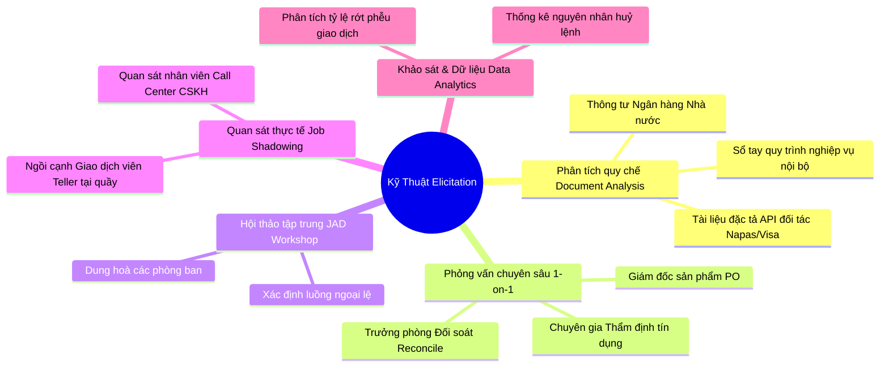

# [TIER 1 - BÀI 2] Kỹ Thuật Khơi Gợi Yêu Cầu & Quản Lý Xung Đột Stakeholder Trong Ngân Hàng

**Mục tiêu bài học:** Làm chủ 5 kỹ thuật khơi gợi yêu cầu (Elicitation Techniques) hiệu quả nhất trong môi trường ngân hàng, nghệ thuật dung hoà mâu thuẫn giữa Khối Kinh Doanh và Khối Quản Trị Rủi Ro, và cách thiết lập Ma Trận Đánh Đổi (Trade-Off Matrix).

---

## 1. 5 Kỹ Thuật Khơi Gợi Yêu Cầu (Elicitation Techniques) Cốt Lõi

Trong ngân hàng, yêu cầu thường không nằm sẵn trên giấy mà nằm rải rác trong đầu các chuyên viên nghiệp vụ hoặc ẩn sau các quy chế nội bộ dài hàng trăm trang:



### Chi tiết ứng dụng thực tế:
1. **Document Analysis (Bắt buộc tiên quyết):** Trước khi gặp bất kỳ stakeholder nào, BA phải đọc kỹ các thông tư liên quan của Ngân hàng Nhà nước (ví dụ: Thông tư 39 về cho vay, Thông tư 19 về dịch vụ thẻ) và tài liệu quy chế nội bộ. Nếu không đọc trước, bạn sẽ bị coi là thiếu chuyên nghiệp trong các buổi họp với phòng Pháp chế.
2. **Job Shadowing (Quan sát tại quầy):** Đi xuống chi nhánh hoặc phòng giao dịch, ngồi trực tiếp cạnh Giao dịch viên (Teller) để xem họ bấm phần mềm Core Banking xử lý một giao dịch nộp tiền/rút tiền mất bao nhiêu thao tác và gặp lỗi gì.
3. **Joint Application Design (JAD Workshop):** Đưa tất cả các bên liên quan (Product, IT, Risk, Ops, Legal) vào một phòng họp để chốt các điểm rẽ nhánh quan trọng.

---

## 2. Nghệ Thuật Quản Lý Xung Đột Giữa Kinh Doanh (Business) và Rủi Ro (Risk/Compliance)

Đây là cuộc chiến kinh điển nhất mà mọi Banking BA đều phải đối mặt:

| Tiêu Chí | Góc Nhìn Khối Kinh Doanh (Business / Growth) | Góc Nhìn Khối Rủi Ro & Tuân Thủ (Risk & Legal) | Vai Trò Dung Hoà Của Banking BA |
| :--- | :--- | :--- | :--- |
| **Mục tiêu chính** | Tăng trưởng người dùng mới, tăng doanh số giao dịch, trải nghiệm mượt mà không ma sát (Frictionless UX). | Chống gian lận (Anti-fraud), ngăn ngừa nợ xấu, tuân thủ 100% quy định pháp luật của NHNN. | Thiết kế **Hệ thống phân tầng rủi ro (Risk-Based Tiering)** và tự động hoá kiểm tra nền. |
| **Ví dụ: Luồng mở tài khoản eKYC** | *"Chỉ cần chụp mặt và nhập số điện thoại là mở được tài khoản ngay trong 30 giây!"* | *"Phải bắt khách hàng quay mặt 4 hướng, quét NFC CCCD gắn chip, kiểm tra CIC và chờ phê duyệt thủ công 24 giờ!"* | **Giải pháp BA:** Cho phép mở tài khoản hạn mức thấp (Tier 1: < 20 triệu/tháng) bằng eKYC tự động; khi muốn nâng hạn mức cao (Tier 2) mới kích hoạt quét NFC và xác thực sinh trắc học. |
| **Ví dụ: Hạn mức chuyển tiền không OTP** | *"Cho phép chuyển dưới 5 triệu đồng không cần nhập mã PIN/OTP để nhanh chóng."* | *"Mọi giao dịch trên 100,000 VND đều phải bắt nhập OTP và nhận diện khuôn mặt."* | **Giải pháp BA:** Tuân thủ chuẩn Quyết định 2345/QĐ-NHNN: Giao dịch dưới 10 triệu/lần và tổng dưới 20 triệu/ngày chỉ cần Soft OTP; giao dịch trên 10 triệu bắt buộc Face Matching sinh trắc học. |

---

## 3. Khung Phản Biện Quyết Định (Trade-off Matrix)

Khi đứng trước một bài toán có nhiều quan điểm trái chiều, Banking BA không được đoán mò mà phải lập **Bảng Ma Trận Đánh Đổi**:

```text
[Vấn Đề Cần Quyết Định]
  ├── Phương Án A (Thiên về Trải nghiệm UX) -> Phân tích Ưu / Nhược điểm / Rủi ro tiềm ẩn
  ├── Phương Án B (Thiên về Bảo mật & Rủi ro) -> Phân tích Ưu / Nhược điểm / Tác động rớt khách
  └── Phương Án Khuyến Nghị (Balanced Solution) -> Đưa ra số liệu định lượng để thuyết phục hai bên
```

> [!TIP]
> **Quy tắc vàng khi làm việc với Khối Rủi ro (Risk Management):**  
> Đừng bao giờ nói: *"Làm thế này khách hàng sẽ khó chịu lắm"*.  
> Hãy nói: *"Dựa trên dữ liệu 100,000 giao dịch tháng trước, nếu thêm bước xác thực này thì tỷ lệ rớt phễu ước tính tăng 24%, gây giảm khoảng 15 tỷ đồng doanh thu thanh toán; thay vào đó chúng ta có thể áp dụng cơ chế chấm điểm rủi ro theo Device ID và IP để chỉ kích hoạt bước này với các giao dịch có độ nghi ngờ cao"*.
