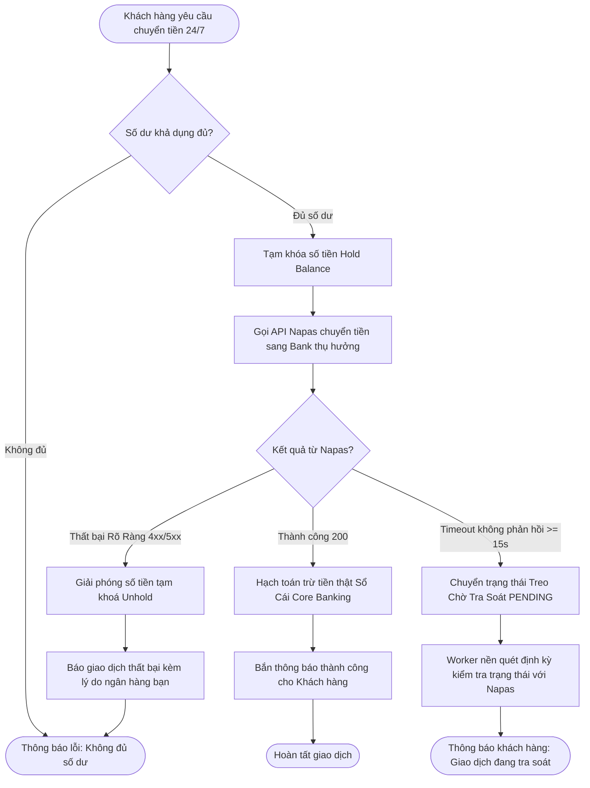
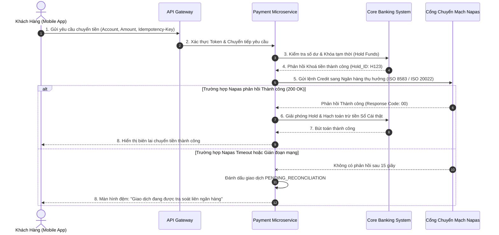

# [TIER 1 - BÀI 3] Mô Hình Hóa Quy Trình Nghiệp Vụ Chuẩn BPMN 2.0 & UML Trong Hệ Thống Ngân Hàng

**Mục tiêu bài học:** Sử dụng thành thạo chuẩn mô hình hóa quy trình nghiệp vụ quốc tế **BPMN 2.0 (Business Process Model and Notation)** và **UML Sequence Diagram** để mô tả các luồng nghiệp vụ ngân hàng phức tạp nhiều hệ thống tham gia.

---

## 1. Bản Chất Chuẩn BPMN 2.0 Trong Ngân Hàng

Một quy trình ngân hàng không bao giờ chỉ do một người hay một hệ thống thực hiện. BPMN 2.0 sử dụng cấu trúc **Pools & Swimlanes** để phân tách trách nhiệm rõ ràng:
- **Pool (Hồ quy trình):** Đại diện cho một tổ chức hoặc hệ thống độc lập (ví dụ: *Ngân Hàng Phát Hành*, *Napas*, *Ngân Hàng Thụ Hưởng*).
- **Swimlane (Làn bơi):** Phân chia vai trò bên trong một Pool (ví dụ: *Khách Hàng (App)*, *Hệ Thống Phê Duyệt Tự Động (BPM/BRMS)*, *Giao Dịch Viên (Teller)*, *Kiểm Soát Viên (Supervisor)*).

### Các thành phần cốt lõi của BPMN 2.0:
1. **Events (Sự kiện):**
   - *Start Event:* Bắt đầu (Khách hàng bấm chuyển tiền).
   - *Intermediate Timer Event:* Chờ 15 phút để nhận phản hồi từ Napas.
   - *Boundary Error Event:* Bắt lỗi rớt mạng hoặc tài khoản đích bị khoá.
   - *End Event:* Kết thúc thành công hoặc huỷ giao dịch an toàn.
2. **Gateways (Cổng rẽ nhánh logic):**
   - **Exclusive Gateway (XOR - Ký hiệu dấu X):** Chỉ đi đúng 1 nhánh duy nhất (ví dụ: *Số dư đủ* HOẶC *Số dư không đủ*).
   - **Parallel Gateway (AND - Ký hiệu dấu +):** Tách ra nhiều nhánh chạy song song cùng lúc (ví dụ: *Vừa gửi thông báo Push Notification* VÀ *vừa hạch toán Sổ cái Core Banking*).
   - **Inclusive Gateway (OR - Ký hiệu hình tròn O):** Cho phép kích hoạt 1 hoặc nhiều nhánh thỏa điều kiện.
   - **Event-based Gateway:** Đi theo nhánh của sự kiện nào xảy ra trước (ví dụ: *Nhận được phản hồi thành công từ Napas* HOẶC *Hết thời gian chờ Timeout 30 giây*).

---

## 2. Sơ Đồ BPMN Minh Họa: Luồng Chuyển Tiền Liên Ngân Hàng 24/7 Qua Napas

---

## 3. Sequence Diagram (Sơ Đồ Tuần Tự) Giữa Các Hệ Thống Phân Tán

Khi làm việc với các Kỹ sư Hệ thống (Solution Architects & Developers), Banking BA bắt buộc phải thể hiện được thứ tự trao đổi bản tin qua **Sequence Diagram**:

---

## 4. 3 Lỗi Sai Chí Mạng Của BA Khi Vẽ Sơ Đồ Nghiệp Vụ Ngân Hàng

1. **Chỉ vẽ luồng màu hồng (Happy Path Only):** Quên mất rằng trong mạng viễn thông và liên ngân hàng, tỷ lệ lỗi mạng luôn chiếm từ 0.5% đến 2%. Sơ đồ thiếu nhánh **Timeout & Exception Handling** sẽ khiến Dev tự code bừa và gây ra thảm họa tài chính.
2. **Nhầm lẫn giữa "Trừ tiền thật" (Debit/Credit Settlement) và "Tạm khoá số dư" (Hold Funds):** Trong ngân hàng, khi gọi dịch vụ bên ngoài, nguyên tắc luôn là: **Khoá tiền trước ➔ Gọi đối tác ➔ Nếu thành công thì hạch toán trừ tiền thật ➔ Nếu lỗi thì Unhold**. Tuyệt đối không trừ tiền thật trước khi biết chắc đối tác đã nhận được lệnh.
3. **Thiếu cơ chế Đảo lệnh (Reversal):** Không định nghĩa luồng hệ thống phải gửi bản tin gì sang Napas/Core khi giao dịch bị huỷ giữa chừng.
