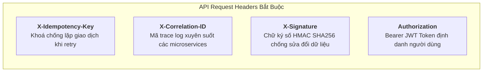

# [TIER 1 - BÀI 5] Thiết Kế Data Dictionary & Đặc Tả Hợp Đồng API (API Contract) Trong Ngân Hàng

**Mục tiêu bài học:** Nắm vững cách thiết kế **Từ điển Dữ liệu (Data Dictionary)** chuẩn chỉnh cho hệ thống tài chính (tránh lỗi làm tròn tiền lẻ), và viết **Đặc tả hợp đồng API (API Contract Spec)** hỗ trợ các giao thức bảo mật và cơ chế chống trùng lặp giao dịch (Idempotency).

---

## 1. Thiết Kế Data Dictionary Trong Hệ Thống Tài Chính Ngân Hàng

Trong phát triển phần mềm thông thường, lập trình viên có thể dùng kiểu `FLOAT` hoặc `DOUBLE`. Nhưng trong **Ngân Hàng**, đây là một lỗi sơ đẳng có thể dẫn đến bị sa thải, vì số thực dấu phẩy động sẽ gây ra **sai số làm tròn (Floating Point Rounding Error)** dẫn đến lệch sổ cái kế toán hàng tỷ đồng.

### Quy tắc thiết kế kiểu dữ liệu tài chính:
1. **Số tiền (Monetary Amounts):** Bắt buộc dùng `DECIMAL(18, 4)` hoặc `BIGINT` (lưu trữ theo đơn vị tiền tệ nhỏ nhất, ví dụ cents hoặc đồng lẻ).
2. **Khóa chính & Định danh (IDs):** Sử dụng `UUIDv4` hoặc `VARCHAR(64)` có tiền tố nhận diện rõ ràng (ví dụ: `TXN_...`, `CUST_...`, `ACC_...`).
3. **Thời gian (Timestamps):** Bắt buộc lưu trữ chuẩn `UTC (ISO 8601)` có múi giờ (`YYYY-MM-DDTHH:mm:ss.sssZ`).

### Bảng Từ Điển Dữ Liệu Thực Tế: Bảng `account_balance_ledgers`
| Tên Trường (Field) | Kiểu Dữ Liệu | Ràng Buộc (Constraints) | Mô Tả & Quy Tắc Nghiệp Vụ |
| :--- | :--- | :--- | :--- |
| `ledger_entry_id` | `VARCHAR(64)` | PRIMARY KEY | Định danh duy nhất của dòng bút toán sổ cái |
| `account_number` | `VARCHAR(20)` | NOT NULL, INDEX | Số tài khoản thanh toán của khách hàng |
| `entry_type` | `VARCHAR(10)` | NOT NULL, CHECK (`DEBIT`, `CREDIT`) | Loại bút toán: `DEBIT` (Ghi Nợ/Trừ tiền) hoặc `CREDIT` (Ghi Có/Cộng tiền) |
| `amount` | `DECIMAL(18, 2)`| NOT NULL, CHECK (> 0) | Số tiền của bút toán giao dịch (luôn là số dương) |
| `currency` | `VARCHAR(3)` | NOT NULL, DEFAULT `'VND'` | Loại tiền tệ theo chuẩn ISO 4217 (`VND`, `USD`, `EUR`) |
| `balance_before` | `DECIMAL(18, 2)`| NOT NULL | Số dư thực tế trước khi phát sinh giao dịch |
| `balance_after` | `DECIMAL(18, 2)`| NOT NULL | Số dư thực tế sau khi phát sinh giao dịch |
| `reference_txn_id`| `VARCHAR(64)` | NOT NULL, INDEX | Mã tham chiếu giao dịch gốc từ Payment Gateway/Napas |
| `created_at` | `TIMESTAMP` | NOT NULL, DEFAULT `NOW()` | Thời điểm ghi nhận bút toán vào sổ cái |

---

## 2. Đặc Tả Hợp Đồng API (API Contract Specification) Chuẩn Ngân Hàng

Một API tài chính ngân hàng đòi hỏi các tiêu chuẩn khắt khe về **Header bảo mật** và **Tính Idempotent (Chống lặp)**:



### Chi tiết 2 Header quan trọng nhất mà Banking BA phải đặc tả:
1. **`X-Idempotency-Key` (Cực kỳ quan trọng):**  
   - Khi mạng bị chập chờn, Mobile App tự động gửi lại request (Retry). Nhờ có key này, Backend nhận diện được đây là request trùng và **không bao giờ trừ tiền 2 lần**, chỉ trả về kết quả của lần xử lý đầu tiên.
2. **`X-Correlation-ID` (Traceability):**  
   - Đi qua 10 microservices khác nhau trong ngân hàng (Gateway -> Auth -> Payment -> Risk -> Core Banking). Khi có lỗi, đội ngũ Tech chỉ cần gõ đúng mã ID này là thấy toàn bộ hành trình của giao dịch trong log Elasticsearch/Splunk.

---

## 3. Mẫu Đặc Tả RESTful API: Khởi Tạo Lệnh Chuyển Tiền Liên Ngân Hàng

- **Phương thức:** `POST`
- **Đường dẫn (Endpoint):** `/api/v1/payments/interbank-transfers`
- **Mô tả:** Tiếp nhận lệnh chuyển tiền 24/7 qua Napas từ ứng dụng Mobile Banking.

### Request Payload (JSON):
```json
{
  "sender_account_number": "19038829103019",
  "beneficiary_bank_code": "970436",
  "beneficiary_account_number": "0071001234567",
  "beneficiary_name": "NGUYEN VAN A",
  "amount": 5000000.00,
  "currency": "VND",
  "description": "Thanh toan tien nha thang 10",
  "payment_method": "NAPAS_247_QUICK_TRANSFER"
}
```

### Response 200 OK (Thành công):
```json
{
  "status": "SUCCESS",
  "data": {
    "transaction_id": "TXN_20261003_998124",
    "trace_number": "FT261003881203",
    "fee": 0.00,
    "transferred_at": "2026-10-03T14:15:30Z",
    "sender_account": "19038829103019",
    "beneficiary_name": "NGUYEN VAN A",
    "new_balance": 10500000.00
  }
}
```

### Response 409 Conflict (Bị trùng Idempotency Key - Chống trừ tiền đúp):
```json
{
  "status": "FAILED",
  "error": {
    "code": "DUPLICATE_TRANSACTION_IN_PROGRESS",
    "message": "Giao dịch tương tự đang được xử lý. Vui lòng không thực hiện lại.",
    "correlation_id": "CORR_9921_BBA"
  }
}
```
