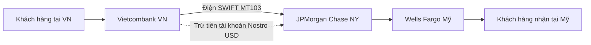

# [TIER 2 - BÀI 2] Chuyển Mạch Thanh Toán Napas 247, Chuẩn ISO 8583 / ISO 20022 & Mạng Lưới SWIFT

**Mục tiêu bài học:** Nắm vững cơ chế vận hành của mạng lưới chuyển mạch quốc gia **Napas 247 & VietQR**, phân biệt hai chuẩn tin điện tài chính quyền lực nhất thế giới **ISO 8583 vs ISO 20022**, và hiểu cơ chế thanh toán quốc tế qua **SWIFT (Nostro & Vostro Account)**.

---

## 1. Mạng Lưới Chuyển Mạch Napas 247 & VietQR Hoạt Động Như Thế Nào?

Tại Việt Nam, **Napas (National Payment Corporation of Vietnam)** đóng vai trò là "Tổng đài trung tâm chuyển mạch" kết nối hơn 50 ngân hàng thương mại:

```mermaid
sequenceDiagram
    autonumber
    participant BankA as Ngân Hàng Gửi (Techcombank)
    participant Napas as Trung Tâm Chuyển Mạch Napas
    participant BankB as Ngân Hàng Nhận (Vietcombank)
    participant SBV as Ngân Hàng Nhà Nước (CITAD)

    Note over BankA,BankB: PHA 1: XỬ LÝ GIAO DỊCH THỜI GIAN THỰC (REAL-TIME SWITCHING - 2 GIÂY)
    BankA->>Napas: Gửi điện chuyển tiền 24/7 (Credit Transfer Request)
    Napas->>BankB: Chuyển tiếp lệnh sang Bank B
    BankB->>BankB: Ghi Có (Credit) vào tài khoản người thụ hưởng ngay
    BankB-->>Napas: Phản hồi Thành Công (Response Code: 00)
    Napas-->>BankA: Báo Bank A thành công
    BankA->>BankA: Ghi Nợ (Debit) tài khoản người chuyển tiền

    Note over Napas,SBV: PHA 2: QUYẾT TOÁN BÙ TRỪ RÒNG ĐỊNH KỲ (NET CLEARING - 3 PHIÊN MỖI NGÀY)
    Napas->>Napas: Tính toán bù trừ: Bank A nợ Bank B 500 tỷ; Bank B nợ Bank A 420 tỷ ➔ Bank A phải trả ròng 80 tỷ
    Napas->>SBV: Gửi bảng quyết toán bù trừ ròng sang Hệ thống CITAD
    SBV->>SBV: Trích 80 tỷ từ Tài khoản thanh toán của Bank A mở tại NHNN chuyển sang Bank B
```

> [!NOTE]
> **Điểm mấu chốt một BA cần hiểu:**  
> Người dùng nhìn thấy tiền được cộng vào tài khoản người nhận **sau 2 giây** (Real-time). Nhưng thực tế **tiền thật giữa hai ngân hàng chưa hề được chuyển giao ngay lúc đó!** Tiền chỉ được quyết toán bù trừ ròng vào các khung giờ cố định trong ngày (09:00, 14:00, 16:30) thông qua tài khoản mở tại Ngân hàng Nhà nước.

---

## 2. So Sánh Hai Chuẩn Tin Điện Tài Chính: ISO 8583 vs ISO 20022

Khi làm việc với các hệ thống thanh toán, BA sẽ thường xuyên gặp hai định dạng bản tin này:

| Tiêu Chí So Sánh | Chuẩn ISO 8583 (Legacy / Thẻ & ATM) | Chuẩn ISO 20022 (Modern / Chuẩn Tương Lai) |
| :--- | :--- | :--- |
| **Định dạng dữ liệu** | Dạng nhị phân Bitmap và chuỗi ký tự cố định (Fixed-length string). | Định dạng XML hoặc JSON có cấu trúc phong phú. |
| **Khả năng đọc hiểu** | Con người không thể đọc trực tiếp (Cần phần mềm dịch trường bit). | Dễ đọc, dễ hiểu theo chuẩn thẻ mô tả ngữ nghĩa (Rich Data). |
| **Dung lượng thông tin** | Bị giới hạn nghiêm ngặt (chỉ truyền được mã tài khoản, số tiền, mã ngân hàng). | Mang được lượng thông tin khổng lồ: Mã số thuế, hoá đơn điện tử, thông tin người thụ hưởng chi tiết. |
| **Phạm vi ứng dụng** | Giao dịch quẹt thẻ POS, rút tiền ATM, bản tin chuyển mạch Napas cũ. | Chuẩn bắt buộc mới của SWIFT (CBPR+), FedNow (Mỹ), và Napas thế hệ mới. |

---

## 3. Chuyển Tiền Quốc Tế Qua Mạng Lưới SWIFT & Tài Khoản Nostro / Vostro

**SWIFT (Society for Worldwide Interbank Financial Telecommunication)** thực chất **không phải là hệ thống chuyển tiền**, mà là **hệ thống nhắn tin tài chính siêu bảo mật**.

Khi Ngân hàng A (Việt Nam) muốn chuyển 100,000 USD sang Ngân hàng B (Mỹ), hai ngân hàng sử dụng cặp tài khoản đặc biệt:
- **Tài khoản Nostro ("Our money on your books"):** Tài khoản của ngân hàng chúng ta mở tại ngân hàng đối tác ở nước ngoài (ví dụ: Techcombank mở tài khoản USD tại JPMorgan Chase New York).
- **Tài khoản Vostro ("Your money on our books"):** Tài khoản của ngân hàng nước ngoài mở tại ngân hàng chúng ta (ví dụ: Citibank mở tài khoản VND tại Techcombank).



- **Bản tin SWIFT MT103:** Bản tin chuyển khoản tiêu chuẩn cho khách hàng cá nhân/doanh nghiệp một lần (Single Customer Credit Transfer).
- **Bản tin SWIFT MT202:** Bản tin thanh toán trực tiếp giữa các định chế tài chính với nhau (Financial Institution Transfer).
