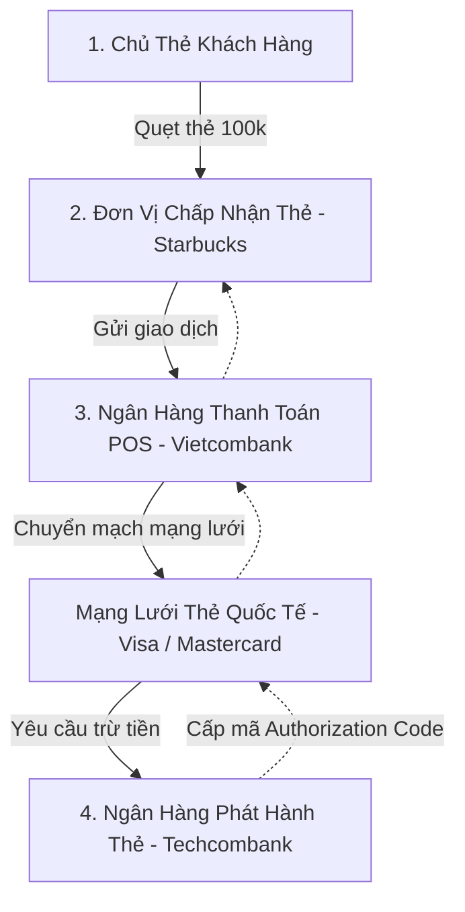

# [TIER 2 - BÀI 3] Hệ Thống Thẻ (Cards), Cổng POS, Mô Hình Phí MDR & Quy Trình Tra Soát Chargeback

**Mục tiêu bài học:** Nắm trọn vẹn mô hình 4 bên (Four-Party Model) của các tổ chức thẻ quốc tế (Visa, Mastercard), phân biệt sự khác nhau giữa **Ủy quyền (Authorization) vs Quyết toán (Settlement)**, và hiểu sâu cơ chế phí **MDR & Tranh chấp Chargeback**.

---

## 1. Mô Hình 4 Bên (The Four-Party Card Payment Model)

Khi bạn cầm một chiếc thẻ tín dụng của Techcombank (Visa) vào một nhà hàng Starbuck (sử dụng máy POS của Vietcombank) để thanh toán 100,000 VND, có 5 bên tham gia vào guồng quay:



### Các vai trò nghiệp vụ:
- **Cardholder:** Người sở hữu thẻ thanh toán.
- **Merchant (ĐVCNT):** Cửa hàng, doanh nghiệp bán hàng có lắp máy POS hoặc tích hợp cổng thanh toán e-commerce.
- **Acquirer Bank (Ngân hàng thanh toán / chấp nhận thẻ):** Ngân hàng cung cấp máy POS hoặc cổng thanh toán cho Merchant.
- **Card Scheme (Tổ chức thẻ):** Visa, Mastercard, JCB, Napas.
- **Issuer Bank (Ngân hàng phát hành thẻ):** Ngân hàng cấp thẻ và cấp hạn mức tín dụng cho khách hàng.

---

## 2. Vòng Đời Giao Dịch Thẻ: Ủy Quyền (Auth) vs Quyết Toán (Settlement)

Một trong những sai lầm phổ biến nhất của BA mới vào ngành thẻ là nghĩ rằng *"Quẹt thẻ xong là tiền đã về túi người bán"*. Thực tế trải qua 3 giai đoạn:

```text
[Giai đoạn 1: Authorization (Thời gian thực - 2 giây)]
  Khách hàng quẹt thẻ -> Issuer kiểm tra hạn mức -> Khoá tiền (Hold Amount) -> Trả về mã Auth Code (vd: 889123).
  Lúc này tiền chưa chuyển đi đâu cả, chỉ bị phong toả số dư khả dụng!

[Giai đoạn 2: Clearing (Tập hợp tệp cuối ngày - EOD)]
  Đêm xuống, máy POS đóng ca (Batch Settlement) -> Gửi toàn bộ danh sách hoá đơn trong ngày sang Acquirer.
  Acquirer đóng tệp (Clearing File) gửi sang Visa/Mastercard để đối chiếu.

[Giai đoạn 3: Settlement (Chuyển tiền thật - T+1 đến T+2 ngày)]
  Visa/Mastercard tính toán bù trừ: Thu tiền từ Issuer (Techcombank) và chuyển tiền cho Acquirer (Vietcombank).
  Acquirer trừ phí dịch vụ và giải ngân tiền sạch vào tài khoản của Merchant (Starbucks).
```

---

## 3. Dòng Tiền & Cấu Trúc Phí MDR (Merchant Discount Rate)

Merchant không bao giờ nhận trọn vẹn 100,000 VND từ khách hàng, mà phải trả **Phí chấp nhận thẻ (MDR - thường từ 1.5% đến 2.5%)**:

```text
Khách hàng thanh toán: 100,000 VND
Phí MDR thỏa thuận: 2.0% (2,000 VND)
Starbucks thực nhận về tài khoản: 98,000 VND
```

### 2,000 VND tiền phí được chia sẻ như thế nào?
1. **Interchange Fee (Phí chia sẻ cho Ngân hàng phát hành - Issuer):** Chiếm phần lớn nhất (khoảng 1.2% - 1.4%). Đây là nguồn thu chính của Techcombank để bù đắp chi phí vốn, rủi ro gian lận và tài trợ chương trình tích điểm hoàn tiền cho chủ thẻ.
2. **Card Scheme Fee (Phí mạng lưới Visa/Mastercard):** Khoảng 0.15% - 0.3% cho dịch vụ chuyển mạch toàn cầu.
3. **Acquiring Markup (Lợi nhuận của Ngân hàng POS - Acquirer):** Phần còn lại (khoảng 0.4% - 0.5%) để duy trì máy POS, đường truyền và rủi ro thu nợ.

---

## 4. Quy Trình Tra Soát & Đòi Bồi Hoàn (Dispute & Chargeback)

Khi khách hàng kiểm tra sao kê thấy một giao dịch lạ (bị hack thẻ, hoặc mua hàng online nhưng không nhận được hàng):
1. **Khách hàng khiếu nại với Issuer:** Yêu cầu tra soát giao dịch.
2. **Issuer gửi yêu cầu Đòi bồi hoàn (First Chargeback):** Thông qua cổng của Visa/Mastercard đòi tiền lại từ Acquirer.
3. **Acquirer yêu cầu Merchant xuất trình bằng chứng (Representment):** Merchant có 7 - 14 ngày để tải lên hoá đơn có chữ ký, biên lai nhận hàng, log IP/OTP.
4. **Phán quyết cuối cùng (Arbitration):** Nếu Merchant không chứng minh được, tiền sẽ bị tự động trích trả lại cho khách hàng và Merchant bị phạt phí Chargeback fee ($25 - $50/vụ).
