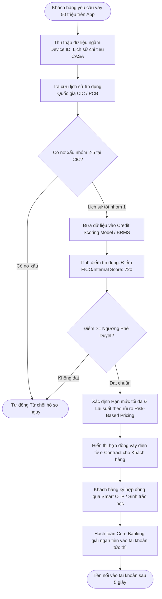

# [TIER 2 - BÀI 4] Cho Vay Kỹ Thuật Số (Digital Lending), Chấm Điểm Tín Dụng CIC & Phê Duyệt Tự Động (STP)

**Mục tiêu bài học:** Nắm trọn vẹn quy trình phê duyệt khoản vay tiêu dùng trực tuyến không cần gặp mặt (Straight-Through Processing - STP), cơ chế tra cứu dữ liệu tín dụng quốc gia **CIC**, và cách vận hành của **Công cụ Ra Quyết Định Tín Dụng (Decision Engine / BRMS)**.

---

## 1. Bản Chất Quy Trình Phê Duyệt Vay Trực Tuyến Tự Động (STP Lending Flow)

Trong ngân hàng truyền thống, một khoản vay mất từ 3 - 7 ngày làm việc để thu thập hồ sơ giấy tờ, sao kê lương, gặp nhân viên tín dụng và ký hợp đồng. Với **Digital Lending (Ngân hàng số)**, toàn bộ chu trình từ lúc bấm đăng ký đến khi tiền nổi trên tài khoản được rút ngắn xuống **dưới 3 phút**:



---

## 2. Dữ Liệu Tín Dụng Quốc Gia CIC (Credit Information Center)

CIC trực thuộc Ngân hàng Nhà nước Việt Nam là cơ sở dữ liệu quan trọng nhất mà mọi ngân hàng và công ty tài chính đều bắt buộc phải kết nối và báo cáo định kỳ:

### 5 Nhóm nợ chuẩn theo quy định của Ngân hàng Nhà nước:
| Nhóm Nợ | Tên Gọi Nghiệp Vụ | Định Nghĩa Quá Hạn | Tỷ Lệ Trích Lập Dự Phòng Của Ngân Hàng | Khả Năng Vay Mới |
| :---: | :--- | :--- | :---: | :--- |
| **Nhóm 1** | **Nợ đủ tiêu chuẩn** | Quá hạn dưới 10 ngày (hoặc trả nợ đúng hạn) | 0% | Được vay bình thường |
| **Nhóm 2** | **Nợ cần chú ý** | Quá hạn từ 10 ngày đến 90 ngày | 5% | Cảnh báo cao, hầu hết các app số sẽ từ chối tự động |
| **Nhóm 3** | **Nợ dưới tiêu chuẩn** | Quá hạn từ 91 ngày đến 180 ngày | 20% | Từ chối 100% |
| **Nhóm 4** | **Nợ nghi ngờ** | Quá hạn từ 181 ngày đến 360 ngày | 50% | Từ chối 100% |
| **Nhóm 5** | **Nợ có khả năng mất vốn** | Quá hạn trên 360 ngày | 100% | Từ chối 100% (Ghi nợ xấu trên CIC trong 5 năm) |

> [!IMPORTANT]
> **Logic tra cứu CIC của Banking BA:**  
> Mỗi lần gọi API sang cổng CIC đều tốn chi phí (khoảng 30,000 - 50,000 VND/lần tra cứu bản báo cáo chi tiết). Do đó, BA phải thiết kế **bộ lọc trước (Pre-Screening Rules)** tại hệ thống nội bộ (kiểm tra blacklist nội bộ, kiểm tra độ tuổi, thu nhập ước tính) trước khi kích hoạt API gọi sang CIC để tiết kiệm hàng tỷ đồng chi phí vận hành cho ngân hàng.

---

## 3. Công Cụ Ra Quyết Định Nghiệp Vụ (Business Rule Management System - BRMS)

Banking BA không trực tiếp viết code giải ngân mà thường phối hợp với Khối Quản trị Rủi ro (Risk Division) để cấu hình các luật nghiệp vụ (Rules) trên các engine như Drools, FICO Blaze Advisor, hoặc Camunda DMN:

```text
Rule 1: IF Khách hàng có tài khoản CASA duy trì số dư bình quân > 10 triệu trong 6 tháng 
        THEN Cộng +50 điểm tín dụng.

Rule 2: IF Tỷ lệ Nợ trên Thu nhập (DTI - Debt-to-Income) > 50% 
        THEN Giảm hạn mức cho vay đề xuất xuống 30%.

Rule 3: IF Khách hàng có lịch sử trả nợ thẻ tín dụng đúng hạn 12 tháng liên tiếp
        THEN Áp dụng lãi suất ưu đãi giảm 1.5%/năm (Risk-based pricing).
```
