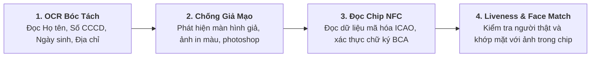

# [TIER 2 - BÀI 5] eKYC, Quét Chip NFC, Sinh Trắc Học QĐ 2345 & Phòng Chống Rửa Tiền AML

**Mục tiêu bài học:** Nắm vững kiến trúc định danh khách hàng điện tử **eKYC toàn trình**, kỹ thuật đọc **chip NFC CCCD gắn chip**, các quy định bắt buộc theo **Quyết định 2345/QĐ-NHNN** của Thống đốc Ngân hàng Nhà nước, và luồng cảnh báo giao dịch đáng ngờ **AML**.

---

## 1. Toàn Cảnh Quy Trình Định Danh Khách Hàng Điện Tử (eKYC Pipeline)

eKYC (Electronic Know Your Customer) là "cánh cổng đầu tiên" của bất kỳ ứng dụng Ngân hàng số nào. Để đảm bảo an toàn tuyệt đối, một luồng eKYC chuẩn ngân hàng phải trải qua 4 lớp phòng thủ:



### Chi tiết kỹ thuật từng lớp:
1. **OCR (Optical Character Recognition):** Bóc tách ký tự từ ảnh chụp 2 mặt CCCD. BA cần định nghĩa các quy tắc kiểm tra tính hợp lệ của số CCCD (12 chữ số theo quy tắc mã tỉnh, giới tính, thế kỷ sinh).
2. **Document Liveness & Anti-Spoofing:** Sử dụng mô hình AI phát hiện tài liệu có bị chói loá, bị chụp lại qua màn hình máy tính (Moire pattern) hoặc dán đè ảnh hay không.
3. **NFC Chip Reading (Chuẩn ICAO 9303):** Ứng dụng Mobile kích hoạt sóng NFC tầm ngắn để đọc dữ liệu sinh trắc học và ảnh gốc có độ phân giải cao được ký số trực tiếp từ Bộ Công An (C06).
4. **Facial Liveness Detection (Chống Deepfake):** Yêu cầu người dùng thực hiện các cử động tự nhiên (nháy mắt, mỉm cười, quay đầu) để xác nhận là người thật đang thao tác trực tiếp trước camera, sau đó so khớp với ảnh trong chip (đạt độ tương đồng tối thiểu 85%).

---

## 2. Quyết Định 2345/QĐ-NHNN Về Triển Khai Giải Pháp An Toàn Thanh Toán Trực Tuyến

Ban hành có hiệu lực từ ngày **01/07/2024**, đây là quy định pháp lý mang tính bước ngoặt mà bất kỳ Banking BA nào cũng bắt buộc phải nắm lòng khi thiết kế các tính năng thanh toán:

| Ngưỡng Giao Dịch | Phương Thức Xác Thực Bắt Buộc | Rủi Ro Phải Ngăn Chặn |
| :--- | :--- | :--- |
| **Giao dịch < 10,000,000 VND/lần** (Và tổng cộng trong ngày chưa vượt quá 20 triệu) | Xác thực bằng mã PIN hoặc mã xác thực một lần **Smart OTP / Soft OTP** trên app. | Rủi ro người dùng quên mật khẩu, tối ưu trải nghiệm nhanh cho các khoản chi tiêu nhỏ hàng ngày. |
| **Giao dịch $\ge$ 10,000,000 VND/lần** HOẶC **Tổng giá trị giao dịch trong ngày vượt 20,000,000 VND** | **BẮT BUỘC xác thực sinh trắc học khuôn mặt (Face Matching)** khớp đúng với dữ liệu lưu trên chip CCCD đã đăng ký. | Ngăn chặn triệt để kẻ gian lừa đảo chuyển tiền lớn sau khi chiếm đoạt tài khoản hoặc cài mã độc. |
| **Đăng nhập và giao dịch trên THIẾT BỊ MỚI lần đầu tiên** | **BẮT BUỘC xác thực sinh trắc học khuôn mặt** trước khi cho phép kích hoạt tài khoản trên thiết bị đó. | Ngăn chặn kẻ trộm SIM, hack OTP để đăng nhập trên máy tính hoặc điện thoại khác. |

---

## 3. Hệ Thống Phòng Chống Rửa Tiền AML (Anti-Money Laundering)

Theo Luật Phòng, chống rửa tiền và các khuyến nghị của Lực lượng Đặc nhiệm Tài chính Quốc tế (FATF), mọi hệ thống ngân hàng đều phải tích hợp **Hệ Thống Giám Sát Giao Dịch Đáng Ngờ (Transaction Monitoring System - TMS)** chạy ngầm 24/7:

```text
[Luồng Đánh Giá Rủi Ro Giao Dịch AML]
  1. Kiểm tra Danh Sách Đen (Watchlist Screening):
     - Rà soát người chuyển/nhận tiền với Danh sách trừng phạt của Liên Hợp Quốc (UN Sanctions), OFAC, Danh sách khủng bố của Bộ Công An.
  2. Báo Cáo Giao Dịch Lớn (CTR - Cash Transaction Report):
     - Bất kỳ giao dịch tiền mặt từ 400,000,000 VND trở lên phải tự động xuất điện báo cáo Cục Phòng chống rửa tiền (Cục PCRT - NHNN).
  3. Báo Cáo Giao Dịch Đáng Ngờ (STR - Suspicious Transaction Report):
     - Tài khoản mở ra không có hoạt động, đột nhiên nhận liên tiếp 50 món tiền từ 50 người khác nhau trong 1 giờ rồi chuyển sạch sang tài khoản khác.
     - Hệ thống tự động gán cờ cảnh báo rủi ro (Risk Alert Flag) và tạm giữ lệnh để chuyên viên Phòng Tuân thủ kiểm tra thủ công.
```
