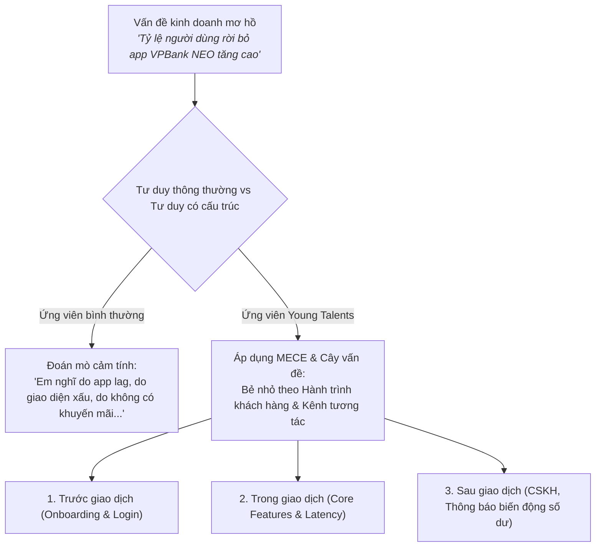
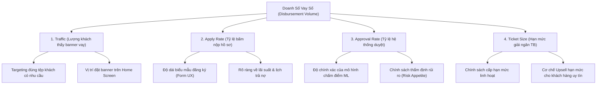

# [VPBANK YOUNG TALENTS] Chuyên Đề 1: Tư Duy Có Cấu Trúc (Structured Problem Solving) Cho Digital BA

**Mục tiêu bài học:** Nắm vững các công cụ tư duy giải quyết vấn đề đẳng cấp của các tập đoàn tư vấn hàng đầu (McKinsey, BCG) được ứng dụng trực tiếp tại VPBank: **MECE Framework**, **Issue Tree (Cây vấn đề)**, và **5 Whys (Phân tích nguyên nhân gốc rễ)** để tự tin bẻ nhỏ mọi bài toán kinh doanh số hóc búa.

---

## 1. Tại Sao VPBank Rất Coi Trọng "Structured Thinking"?

Tại các vòng phỏng vấn Young Talents hoặc thi nhóm (Assessment Center), giám khảo VPBank không bao giờ chấm điểm dựa trên việc bạn nói nhiều hay nói ít, mà chấm vào việc: **Bạn có bẻ nhỏ bài toán một cách mạch lạc và toàn diện hay không.**

---

## 2. Nguyên Tắc MECE (Mutually Exclusive, Collectively Exhaustive)

MECE là nguyên tắc vàng:
* **Mutually Exclusive (Không trùng lặp):** Các nhánh vấn đề không được chồng chéo lên nhau.
* **Collectively Exhaustive (Không bỏ sót):** Tổng hợp tất cả các nhánh phải bao quát trọn vẹn 100% bài toán.

### Ứng dụng thực tế: Phân tích bài toán "Tăng doanh số cho vay tiêu dùng tín chấp trên App VPBank NEO"

Thay vì nói lan man, hãy bẻ bài toán theo công thức MECE:

$$\text{Doanh Số Giải Ngân} = \text{Lưu Lượng Tiếp Cận (Traffic)} \times \text{Tỷ Lệ Đăng Ký (Apply Rate)} \times \text{Tỷ Lệ Phê Duyệt (Approval Rate)} \times \text{Giá Trị Khoản Vay Trung Bình (Ticket Size)}$$

> [!TIP]
> **Điểm cộng tuyệt đối trong phòng phỏng vấn:** Khi giám khảo hỏi *"Làm sao để giải quyết bài toán X?"*, câu mở đầu của bạn nên là: *"Dạ thưa anh/chị, để tiếp cận bài toán này một cách toàn diện và không bỏ sót, em xin phép phân tích theo 3 khía cạnh theo nguyên tắc MECE..."*. Giám khảo sẽ ấn tượng ngay lập tức!

---

## 3. Kỹ Thuật 5 Whys (Tìm Nguyên Nhân Gốc Rễ)

Khi hệ thống gặp sự cố, một Digital BA xuất sắc không chỉ nhìn vào bề nổi mà phải đào sâu tìm nguyên nhân gốc (Root Cause):

### Tình huống mô phỏng tại VPBank:
* **Vấn đề:** Khách hàng phàn nàn giao dịch chuyển tiền VietQR bị chậm vào tối thứ 6.
* **Why 1:** Tại sao giao dịch bị chậm?  
  $\rightarrow$ Vì API gửi lệnh từ App sang hệ thống Thanh toán bị timeout sau 30 giây.
* **Why 2:** Tại sao API bị timeout?  
  $\rightarrow$ Vì hàng đợi tin nhắn (Message Queue) của dịch vụ Napas bị ùn tắc hơn 5,000 giao dịch chưa xử lý.
* **Why 3:** Tại sao hàng đợi lại bị ùn tắc vào tối thứ 6?  
  $\rightarrow$ Vì lưu lượng giao dịch thanh toán ăn uống/mua sắm cuối tuần tăng đột biến gấp 4 lần ngày thường.
* **Why 4:** Tại sao hệ thống không tự động mở rộng (Auto-scaling) để đáp ứng tải tăng cao?  
  $\rightarrow$ Vì cơ chế kiểm tra hạn mức Core Banking đang chạy cơ chế khóa bi quan (Pessimistic Locking) trên một bảng dữ liệu duy nhất, gây nghẽn cổ chai DB.
* **Why 5 (Root Cause):** Tại sao lại dùng khóa bi quan trên bảng dữ liệu đó?  
  $\rightarrow$ Vì kiến trúc dịch vụ này chưa được phân tách (Decoupled) theo mô hình Microservices hiện đại, dẫn đến việc dùng chung tài nguyên giữa luồng tra cứu số dư và luồng trừ tiền.

**Hành động của BA:** Không phải là yêu cầu nâng cấp RAM máy chủ, mà là viết yêu cầu kỹ thuật (Technical Story) tách riêng luồng đọc số dư (Read Replica) và luồng ghi số dư (Write Master) để triệt tiêu điểm nghẽn.

---

## 4. Bài Tập Thực Hành Ứng Dụng (Actionable Drill)

Hãy thử dùng giấy nháp và vẽ cây vấn đề MECE cho đề bài sau:  
*"Ứng dụng Cake by VPBank muốn tăng tỷ lệ người dùng Gen Z mở thẻ thanh toán quốc tế ảo (Virtual Debit Card). Em hãy đề xuất các hướng giải pháp."*

*(Gợi ý cấu trúc MECE: Chia theo Phễu người dùng: Nhận biết (Awareness) $\rightarrow$ Cân nhắc kích hoạt (Activation) $\rightarrow$ Sử dụng thường xuyên (Retention)).*
