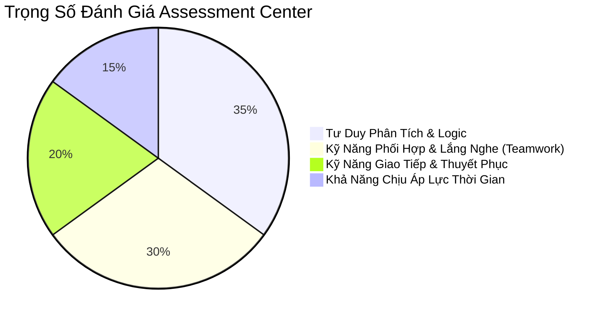
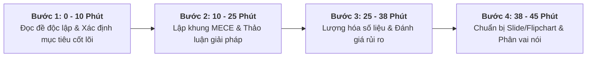

# [VPBANK YOUNG TALENTS] Chuyên Đề 2: Bí Kíp Vượt Ải Vòng Thi Nhóm (Assessment Center Playbook)

**Mục tiêu bài học:** Nắm trọn cẩm nang chiến thuật tác chiến trong vòng **Assessment Center / Case Study Group** – vòng thi có tỷ lệ loại cao nhất (lên đến 70-80%) của các chương trình Young Talents / Management Trainee ngân hàng.

---

## 1. Bản Chất Của Vòng Assessment Center Là Gì?

Rất nhiều bạn lầm tưởng: *"Vào phòng thi nhóm là phải tranh nói thật nhiều, cướp lời người khác để thể hiện bản thân"*.  
👉 **Đây là cách nhanh nhất để bị đánh trượt!**

Các giám khảo (thường là Giám đốc Nhân sự, Giám đốc Khối CNTT, Giám đốc Sản phẩm Số của VPBank) ngồi quan sát xung quanh phòng thi để chấm điểm theo các tiêu chí:

---

## 2. 4 Vai Trò Cốt Lõi Trong Nhóm & Cách Chọn Vai Phù Hợp

Trong một nhóm 5–6 thí sinh, bạn không nhất thiết phải làm Leader mới đỗ. Mỗi vai trò đều có cách tỏa sáng riêng:

| Vai Trò | Nhiệm Vụ Cụ Thể | Câu Cửa Miệng Đắt Giá Để Ghi Điểm |
| :--- | :--- | :--- |
| **1. The Facilitator / Leader (Người điều phối)** | Định hình khung làm việc, phân chia thời gian, khơi gợi ý kiến của các bạn trầm tính. | *"Nhóm mình có 45 phút, em xin phép đề xuất chia thành: 10 phút đọc & lập khung vấn đề, 20 phút thảo luận giải pháp, 10 phút chốt số liệu và 5 phút phân vai thuyết trình nhé cả nhà."* |
| **2. The Structurer (Người dựng khung - Rất hợp với BA)** | Biến các ý tưởng hỗn loạn thành bảng biểu, cây vấn đề MECE, vẽ sơ đồ lên bảng trắng. | *"Ý tưởng của bạn A và bạn B rất hay. Em xin phép hệ thống lại thành 2 nhóm giải pháp: Nhóm tác động ngắn hạn (Quick-wins) và Nhóm nền tảng dài hạn (Strategic)..."* |
| **3. The Timekeeper & Devil's Advocate (Người giữ nhịp & Phản biện)** | Canh thời gian, kéo nhóm về trọng tâm khi bị sa đà, chỉ ra các rủi ro mà nhóm chưa thấy. | *"Chúng ta chỉ còn 12 phút, em xin phép kéo nhóm mình về câu hỏi số 2 của đề bài. Nhân tiện, nếu làm giải pháp này thì chi phí có vượt quá ngân sách 2 tỷ của đề bài không?"* |
| **4. The Synthesizer & Presenter (Người đúc kết & Thuyết trình)** | Tóm tắt các điểm đồng thuận thành câu chuyện mạch lạc để báo cáo trước ban giám khảo. | *"Em xin đại diện nhóm trình bày giải pháp theo nguyên lý Kim Tự Tháp Minto: Đi từ kết quả then chốt trước, sau đó là 3 trụ cột triển khai cụ thể..."* |

---

## 3. Quy Trình 4 Bước Tác Chiến Trong 45 Phút

### Bước 1: Clarify The Goal (Xác định mục tiêu sống còn)
* Đừng vội thảo luận giải pháp ngay! Hãy cùng nhóm thống nhất: **Mục tiêu số 1 của đề bài là gì?**
  * Tăng trưởng người dùng mới (User Acquisition) hay Tăng doanh thu từ khách hàng cũ (Monetization)?
  * Ngân sách và nguồn lực được cấp là bao nhiêu?

### Bước 2: Build The Framework (Dựng khung giải pháp)
* Dùng bảng trắng (Whiteboard / Flipchart) vẽ khung phân tích. Mọi người thảo luận dựa trên khung này thay vì nói suông.

### Bước 3: Prioritize & Quantify (Ưu tiên & Lượng hóa)
* Nhóm đề xuất 10 ý tưởng thì chỉ nên chọn **3 ý tưởng xuất sắc nhất** để đào sâu.
* Luôn gắn với con số: Tốn bao nhiêu tuần phát triển? Tỷ lệ chuyển đổi ước tính bao nhiêu %?

### Bước 4: Minto Pyramid Presentation (Thuyết trình đỉnh cao)
* **Kết luận đi trước (Top-down):** *"Nhóm chúng em khuyến nghị giải pháp X giúp tăng 30% doanh số trong 6 tháng với ngân sách 1.5 tỷ."*
* **3 Luận điểm hỗ trợ:**
  * Luận điểm 1: Trải nghiệm người dùng mượt mà trên App.
  * Luận điểm 2: Tự động hóa thẩm định rủi ro bằng dữ liệu.
  * Luận điểm 3: Kế hoạch triển khai cuốn chiếu theo phương pháp Agile.

---

## 4. Xử Lý Các Tình Huống Khó Trong Phòng Thi Nhóm

### Tình huống 1: Có một bạn trong nhóm nói quá nhiều, cướp lời mọi người
* **Cách xử lý chuyên nghiệp:** Đừng ngắt lời thô bạo. Chờ bạn đó dừng lấy hơi, mỉm cười và nói:  
  *"Cảm ơn góc nhìn rất chi tiết của bạn C. Ý tưởng này rất đáng ghi nhận. Để đảm bảo tính đa chiều và kịp thời gian, mình rất muốn lắng nghe thêm góc nhìn từ bạn D về khía cạnh chi phí triển khai nhé."*

### Tình huống 2: Hai thành viên tranh cãi gay gắt về một chi tiết nhỏ
* **Cách xử lý chuyên nghiệp:** Can thiệp bằng tiêu chí đánh giá khách quan:  
  *"Mình thấy cả hai quan điểm đều có lý. Nhưng vì thời gian có hạn và mục tiêu chính của đề bài là tối ưu thời gian Onboarding dưới 3 phút, mình đề xuất nhóm mình bỏ phiếu nhanh hoặc chọn phương án A làm MVP, phương án B đưa vào pha mở rộng nhé."*
