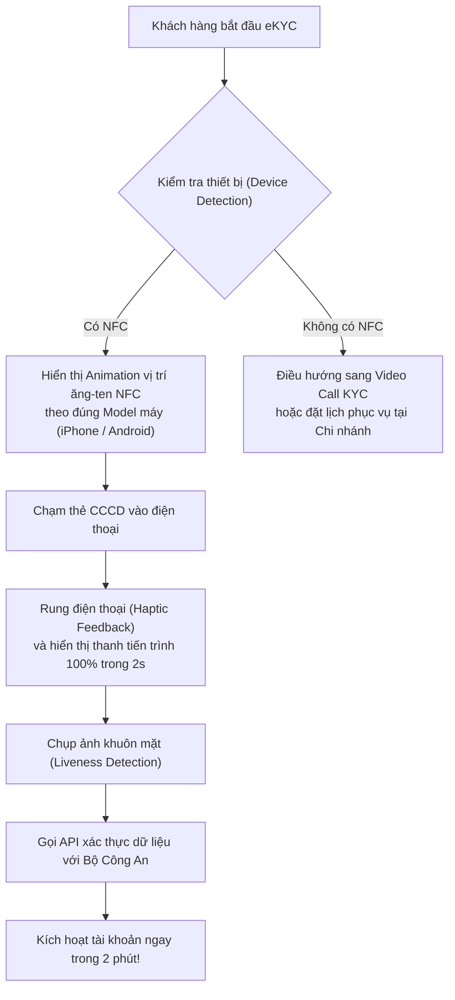
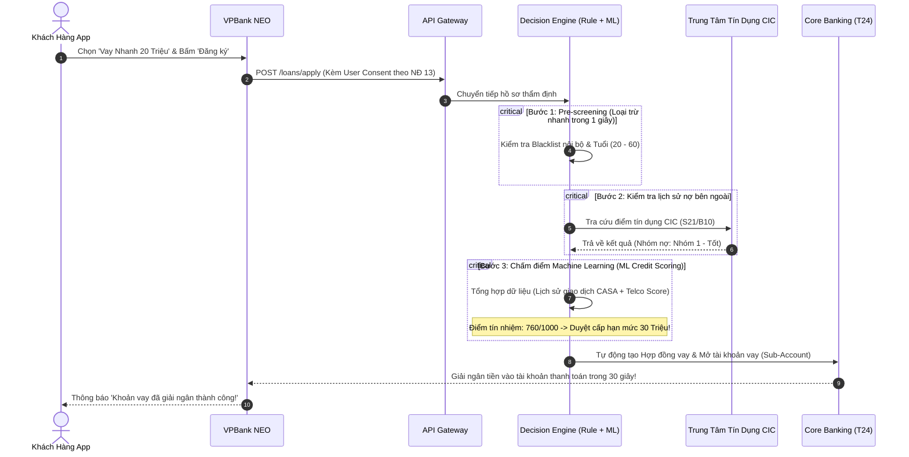

# [VPBANK YOUNG TALENTS] Chuyên Đề 3: Bộ 3 Case Study Sản Phẩm Số Thực Chiến Tại VPBank

**Mục tiêu bài học:** Giải mã kiến trúc sản phẩm, logic nghiệp vụ và bài toán tối ưu hoá thực tế của 3 sản phẩm chủ lực trong hệ sinh thái số VPBank: **VPBank NEO**, **Cake by VPBank**, và **Hệ thống Cho vay thấu chi / Thẻ tín dụng tức thì (Instant Approval)**.

---

## CASE STUDY 1: Tối Ưu Hóa Phễu Mở Tài Khoản eKYC Trên Ứng Dụng VPBank NEO

### 1. Bối cảnh bài toán:
VPBank NEO là ứng dụng ngân hàng số toàn năng. Mỗi tháng có khoảng 150,000 lượt tải app để đăng ký mở tài khoản mới. Tuy nhiên, dữ liệu Product Analytics cho thấy:
* **Tỷ lệ rớt phễu (Drop-off rate):** Lên tới 42% tại bước quét thẻ CCCD gắn chip (NFC).
* **Quy định pháp lý bắt buộc:** **Thông tư 17/2024/TT-NHNN** yêu cầu từ 01/01/2025 mọi tài khoản mở bằng eKYC phải xác thực sinh trắc học khớp đúng với dữ liệu CCCD gắn chip của Bộ Công An, **tuyệt đối không được bỏ qua bước quét NFC**.

### 2. Phân tích nguyên nhân bằng Data & UX:
BA tiến hành phân tích sự cố:
* 65% lượt quét thất bại do người dùng di chuyển thẻ khi chip chưa đọc xong (quá trình đọc chip cần 1.5 - 2.5 giây).
* 25% do người dùng không biết vị trí ăng-ten NFC trên điện thoại (đặt thẻ lung tung khắp màn hình).
* 10% do điện thoại không có NFC hoặc hệ điều hành quá cũ.

### 3. Giải pháp thiết kế sản phẩm của Digital BA:

### 4. Kết quả đo lường (Product Metrics):
* Tỷ lệ quét NFC thành công ngay lần đầu tăng từ 58% lên 89%.
* Tỷ lệ rớt phễu chung của toàn luồng Onboarding giảm từ 42% xuống còn 14%.

---

## CASE STUDY 2: Vay Tiêu Dùng Trực Tuyến & Cấp Thẻ Tín Dụng Tức Thì Trong 3 Phút (Instant Credit)

### 1. Bối cảnh bài toán:
VPBank là ngân hàng dẫn đầu thị phần cho vay tiêu dùng và thẻ tín dụng. Thay vì bắt khách hàng nộp sao kê lương giấy và chờ 3-5 ngày làm việc, ban lãnh đạo đặt mục tiêu: **Quy trình vay và cấp thẻ tín dụng ảo 100% tự động (STP - Straight-Through Processing) trên App trong vòng dưới 3 phút.**

### 2. Thách thức lớn nhất:
Làm sao vừa phê duyệt giải ngân siêu nhanh mà vẫn kiểm soát được tỷ lệ nợ xấu (NPL)?

### 3. Kiến trúc giải pháp của Digital BA:

---

## CASE STUDY 3: Open API & Hệ Sinh Thái Số (Tích Hợp Đối Tác Be Group / E-Wallet)

### 1. Bối cảnh bài toán:
Hệ sinh thái VPBank liên kết chặt chẽ với ứng dụng gọi xe Be Group (Cake by VPBank). Mục tiêu: Cho phép tài xế Be mở tài khoản ngân hàng và nhận tiền cước xe theo thời gian thực (Real-time Settlement), đồng thời người dùng ứng dụng Be có thể liên kết tài khoản VPBank/Cake để thanh toán chuyến đi không cần tiền mặt.

### 2. Vai trò của Digital BA:
* **Thiết kế hợp đồng API (API Specification):** Đảm bảo tính nhất quán giữa hai hệ thống của hai công ty khác nhau.
* **Cơ chế Idempotency & Đối soát:** Ngăn chặn việc trừ tiền đúp khi tài xế bấm xác nhận chuyến đi nhiều lần trong lúc mạng lag.
* **Tuân thủ an toàn:** Sử dụng chuẩn bảo mật mTLS (Mutual TLS) và chữ ký số HMAC-SHA256 trên mọi payload thanh toán.
