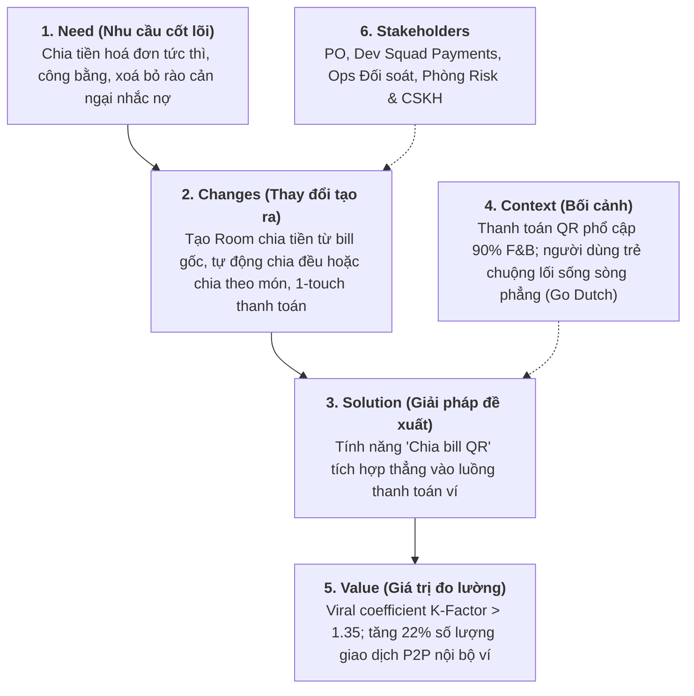

# [PHASE 1] Khởi Tạo & Định Hình Bài Toán (Discovery & Scoping)

**Initiative Name:** Chia Hoá Đơn Nhóm Qua QR Code (Group Bill Splitting via QR)  
**Slug:** `bill_splitting`  
**Date:** 2026-09-13  
**Lead Author:** Principal AI BA & Lead BA  
**BABOK Knowledge Area:** Strategy Analysis & Business Analysis Planning  

---

## 1. Problem Statement (Áp dụng First Principles Thinking & 5W1H)

### Bản chất bài toán (First Principles Analysis):
- **Hiện trạng bề nổi:** Sau các bữa ăn uống, đi chơi theo nhóm (3 - 10 người), việc chia tiền và gom tiền diễn ra cực kỳ phiền toái: 1 người đứng ra trả trước, sau đó chụp ảnh hoá đơn, tính toán thủ công từng món hoặc chia đều, gửi số tài khoản/QR cá nhân vào nhóm Zalo/Telegram rồi phải liên tục nhắc nợ người chưa chuyển.
- **Sự thật cốt lõi (Core Truths):**
  1. **Social Friction (Rào cản tâm lý xã hội):** Người ứng tiền rất ngại nhắc nợ bạn bè; người nợ lại dễ quên hoặc lười mở app ngân hàng gõ số lẻ.
  2. **Calculation Asymmetry (Bất đối xứng tính toán):** Có người không uống bia/rượu, có người ăn chay, nên "chia đều (Split equally)" gây cảm giác bất công; nhưng "chia chi tiết theo món (Split by items)" thì lại tốn quá nhiều thời gian.
  3. **Viral Loop Opportunity:** Mỗi hoá đơn chia tiền là một cơ hội vàng để người dùng mời thêm 3 - 5 người bạn khác mở app thanh toán (K-factor > 1.2).

### Bảng 5W1H chi tiết:
| Khía cạnh | Nội dung phân tích |
| :--- | :--- |
| **Who** | Nhóm bạn bè, đồng nghiệp văn phòng, sinh viên (18 - 35 tuổi) thường xuyên đi ăn uống, du lịch cùng nhau. |
| **What** | Khó khăn, tốn thời gian khi tính toán chia tiền lẻ và ngại ngùng khi nhắc nợ thủ công. |
| **Where** | Tại các quán ăn, nhà hàng, cafe, rạp chiếu phim có thanh toán quét mã QR. |
| **When** | Ngay tại thời điểm thanh toán bill hoặc trong vòng 24 giờ sau sự kiện. |
| **Why** | Giúp người dùng loại bỏ hoàn toàn ma sát tâm lý khi chia tiền, đồng thời tăng tần suất thanh toán P2P và thu hút người dùng mới về ví điện tử mà không tốn chi phí Marketing CAC. |
| **How** | Hiện tại người dùng phải dùng app bên thứ 3 (như Splitwise) để ghi chép công nợ, sau đó lại chuyển khoản qua banking/ví một lần nữa ➔ 2 ứng dụng tách rời, trải nghiệm bị phân mảnh. |

---

## 2. Khung BACCM (Business Analysis Core Concept Model)

---

## 3. Ma Trận RACI Các Bên Liên Quan (Stakeholders Matrix)

| Nhóm / Cá nhân | Vai trò trong sáng kiến | RACI |
| :--- | :--- | :---: |
| Product Owner (PO) | Chốt phạm vi nghiệp vụ, tiêu chí MVP và KPI tăng trưởng | **A** (Accountable) |
| Principal AI BA & Lead BA | Bóc tách logic chia tiền, viết User Stories, AC, API & Data spec | **R** (Responsible) |
| Solution Architect / Tech Lead | Thiết kế kiến trúc WebSocket/Realtime state đồng bộ Room chia tiền | **C** (Consulted) |
| Development Team (FE/BE/Mobile) | Lập trình tính năng Mobile App & Backend Microservice | **R** (Responsible) |
| QA Lead | Thiết kế kịch bản test tiền lẻ (Rounding issue) và concurrency | **R** (Responsible) |
| Fraud & Risk Ops | Rà soát nguy cơ tạo room rửa tiền hoặc gian lận nợ xấu | **C** (Consulted) |
| CSKH (Customer Support) | Xử lý khiếu nại tranh chấp chia sai tiền hoặc lỗi hoàn tiền | **I** (Informed) |

---

## 4. Ranh Giới Phạm Vi (Scope Boundaries: MVP vs Future)

### 4.1. Trong phạm vi (In-Scope - MVP Release)
1. **Khởi tạo phòng chia bill (Create Bill Room):** Từ lịch sử giao dịch đã thanh toán hoặc nhập số tiền tổng thủ công.
2. **2 Cơ chế chia tiền linh hoạt:**
   - *Chia đều (Equal Split):* Nhập số lượng người hoặc chọn bạn bè ➔ Tự động chia đều số tiền.
   - *Chia theo số tiền chỉ định (Custom Amount Split):* Gán số tiền cụ thể cho từng thành viên.
3. **Mã QR động & Deep Link:** Host tạo mã QR nhóm để mọi người quét tham gia phòng tức thì, hoặc gửi link qua Zalo/Telegram.
4. **Nhắc nợ tự động (1-Click Friendly Reminder):** Hệ thống tự gửi Push Notification nhắc nhẹ nhàng, người ứng tiền không cần nhắn tin ngại ngùng.
5. **Thanh toán 1 chạm (1-Touch Pay):** Thành viên chỉ cần bấm "Thanh toán ngay" là tiền từ ví chuyển thẳng sang ví Host trong 100ms.

### 4.2. Ngoài phạm vi (Out-of-Scope - Dành cho Phase 2)
1. OCR quét nhận diện hoá đơn giấy tự động bóc tách từng món ăn (AI Bill Scanner OCR).
2. Chia tiền chéo giữa các ngân hàng khác nhau qua Napas QR (MVP chỉ hỗ trợ thành viên cùng dùng Ví điện tử).
3. Cho phép trả góp hoặc nợ gối đầu qua nhiều buổi tiệc khác nhau.
