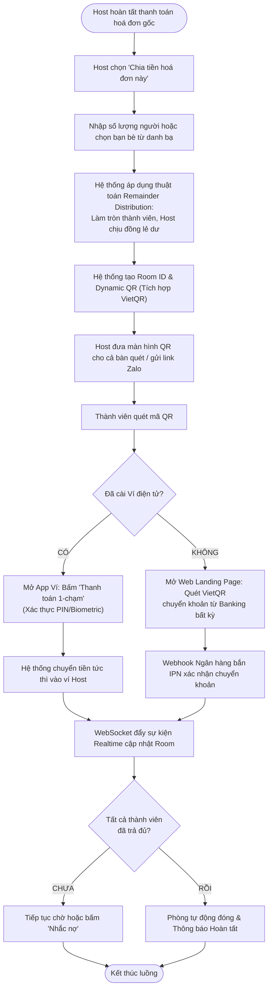

# [PHASE 3] Phân Tích & Đặc Tả Giải Pháp (Analysis & Modeling)

**Initiative Name:** Chia Hoá Đơn Nhóm Qua QR Code (Group Bill Splitting via QR)  
**Slug:** `bill_splitting`  
**Date:** 2026-09-13  
**BABOK Knowledge Area:** Requirements Analysis and Design Definition (RADD)  

---

## 1. Sơ Đồ Luồng Nghiệp Vụ (Process Modeling via Mermaid)

### 1.1. Luồng Tổng Thể Chia Tiền & Thanh Toán (End-to-End Flowchart)



### 1.2. Sơ Đồ Tuần Tự Tương Tác Hệ Thống (Sequence Diagram)

```mermaid
sequenceDiagram
    autonumber
    actor Host as Người tạo phòng (Host)
    actor Member as Thành viên bàn ăn
    participant App as Mobile App Ví
    participant BE as Bill Split Microservice
    participant BankGW as Napas / VietQR Gateway
    participant WS as WebSocket Hub
    participant DB as Database & Redis

    Host->>App: Bấm "Chia tiền hoá đơn" (100,000 VND / 3 người)
    App->>BE: POST /api/v1/bills/split/rooms
    BE->>BE: Tính toán: Mem1=33,333đ, Mem2=33,333đ, Host=33,334đ
    BE->>DB: Tạo bản ghi Room (status: 'ACTIVE', ttl: 72h)
    BE-->>App: Trả về RoomID + DeepLink + VietQR Payload
    Host->>Member: Đưa QR cho thành viên quét

    alt Thành viên dùng Ví Điện Tử (In-App)
        Member->>App: Quét QR -> Mở màn hình xác nhận trả 33,333đ
        Member->>BE: POST /api/v1/bills/split/rooms/{id}/pay (Idempotency Key)
        BE->>DB: Trừ ví Member, cộng ví Host, đổi status: 'PAID'
        BE->)WS: Broadcast event 'MEMBER_PAID' (member_name, amount)
        WS-->>App: Màn hình Host cập nhật tick xanh thành công!
    else Thành viên dùng App Ngân Hàng (VietQR)
        Member->>BankGW: Chuyển khoản VietQR nội dung "BILL_123_MEM2"
        BankGW->>BE: Webhook IPN thông báo nhận tiền thành công
        BE->>DB: Cập nhật status thành viên sang 'PAID'
        BE->)WS: Broadcast event 'MEMBER_PAID'
        WS-->>App: Màn hình Host cập nhật tick xanh thành công!
    end
```

---

## 2. Epics & User Stories (Chuẩn INVEST)

### Epic 1: Quản Lý Phòng Chia Bill & Phân Bổ Tiền (Room & Calculation Engine)

#### User Story US-BS-01: Tạo phòng chia tiền từ giao dịch có sẵn
- **As a:** Người vừa thanh toán hoá đơn ăn uống bằng ví,
- **I want to:** Chọn giao dịch trong lịch sử và bấm nút "Chia tiền ngay",
- **So that:** Tôi không phải tự gõ lại số tiền tổng hay nhớ lại bữa ăn đó hết bao nhiêu.
- **Story Points:** 3 | **Priority (MoSCoW):** Must Have.

#### User Story US-BS-02: Thuật toán phân bổ tiền lẻ (Remainder Distribution)
- **As a:** Hệ thống chia bill,
- **I want to:** Tự động tính toán số tiền mỗi người và gán chênh lệch tiền lẻ (1-2 đồng) vào phần của Host,
- **So that:** Tổng số tiền thu từ các thành viên luôn khớp chính xác 100% với hoá đơn gốc.
- **Story Points:** 2 | **Priority (MoSCoW):** Must Have.

---

### Epic 2: Thanh Toán & Tích Hợp Đa Kênh (Multi-Channel Payment)

#### User Story US-BS-03: Thanh toán 1-chạm nội bộ ví điện tử
- **As a:** Thành viên tham gia phòng đã có tài khoản ví,
- **I want to:** Quét mã QR và bấm "Xác nhận chuyển tiền",
- **So that:** Tiền được chuyển sang ví của Host trong tích tắc mà không cần nhập số tài khoản.
- **Story Points:** 3 | **Priority (MoSCoW):** Must Have.

#### User Story US-BS-04: Thanh toán liên ngân hàng qua VietQR cho khách chưa có ví
- **As a:** Người bạn trong bàn chưa cài đặt ứng dụng ví điện tử,
- **I want to:** Quét mã QR mở app ngân hàng của tôi để chuyển khoản cho Host theo chuẩn VietQR,
- **So that:** Tôi vẫn sòng phẳng trả tiền ngay mà không bị ép buộc phải tải app tại chỗ.
- **Story Points:** 5 | **Priority (MoSCoW):** Must Have.

---

### Epic 3: Trải Nghiệm Tương Tác & Nhắc Nợ (Engagement & Social Nudge)

#### User Story US-BS-05: Nhắc nợ thông minh (1-Click Friendly Nudge)
- **As a:** Host của phòng chia tiền,
- **I want to:** Bấm nút "Nhắc nhẹ" đối với những thành viên chưa thanh toán sau 4 tiếng,
- **So that:** Hệ thống thay tôi gửi thông báo hóm hỉnh mà tôi không phải mở lời đòi nợ ngại ngùng.
- **Story Points:** 2 | **Priority (MoSCoW):** Should Have.

---

## 3. Tiêu Chí Chấp Nhận Chi Tiết (Acceptance Criteria - Gherkin)

### Scenario 1: Tạo phòng chia đều có tiền lẻ (Happy Path + Rounding)
```gherkin
Given Host vừa thanh toán hoá đơn trị giá 100,000 VND
  And Host bấm "Chia tiền hoá đơn này" và chọn số lượng người là 3
 When Hệ thống tính toán phân bổ số tiền
 Then 2 thành viên khách mời mỗi người phải trả đúng 33,333 VND
  And Host gánh số tiền còn lại là 33,334 VND (100,000 - 33,333 * 2)
  And Màn hình hiển thị mã QR động nhóm và danh sách 3 thành viên
```

### Scenario 2: Thành viên thanh toán qua VietQR ngân hàng ngoài (VietQR Flow)
```gherkin
Given Thành viên B chưa có tài khoản ví điện tử
  And Quét mã QR nhóm bằng camera điện thoại
 When Trình duyệt mở trang web chia bill và hiển thị mã VietQR trị giá 33,333 VND
  And Thành viên B mở app Techcombank quét mã và bấm chuyển khoản thành công
 Then Hệ thống nhận Webhook IPN từ Napas trong vòng < 2 giây
  And Cập nhật trạng thái của Thành viên B trên phòng chia bill thành "ĐÃ THANH TOÁN"
  And Màn hình app của Host tự động hiện thông báo tick xanh và tiếng chuông "Ting Ting"
```

### Scenario 3: Phòng hết hạn sau 72 giờ (Expiration Edge Case)
```gherkin
Given Phòng chia bill đã được tạo 72 giờ trước
  And Vẫn còn 1 thành viên chưa thanh toán số tiền 33,333 VND
 When Thời gian chạm mốc 72:00:01
 Then Hệ thống tự động chuyển trạng thái phòng sang "EXPIRED"
  And Vô hiệu hoá mã QR và nút thanh toán của phòng đó
  And Gửi thông báo tổng kết cho Host: "Phòng chia bill đã đóng. Bạn đã thu được 66,667đ / 100,000đ"
```

---

## 4. Từ Điển Dữ Liệu & Mô Hình Thực Thể (Data Dictionary)

### Bảng: `split_rooms` (Quản lý phòng chia bill)
| Tên cột | Kiểu dữ liệu | Khóa | Ràng buộc nghiệp vụ |
| :--- | :--- | :---: | :--- |
| `room_id` | UUID | PK | Định danh duy nhất của phòng chia bill |
| `host_user_id` | VARCHAR(36) | FK | User ID của người tạo phòng |
| `original_tx_id` | VARCHAR(64) | NULL | Mã giao dịch hoá đơn gốc (nếu chia từ bill có sẵn) |
| `total_amount` | DECIMAL(15,2) | NOT NULL | Tổng số tiền cần chia (5,000 <= amount <= 20,000,000) |
| `split_type` | VARCHAR(20) | NOT NULL | `EQUAL` (chia đều) hoặc `CUSTOM` (chỉ định) |
| `status` | VARCHAR(20) | NOT NULL | `ACTIVE`, `COMPLETED`, `EXPIRED`, `CANCELLED` |
| `qr_code_url` | VARCHAR(255) | NOT NULL | Link hình ảnh mã QR động nhóm |
| `expires_at` | TIMESTAMP | NOT NULL | Thời điểm hết hạn (created_at + 72 hours) |

### Bảng: `split_members` (Danh sách thành viên trong phòng)
| Tên cột | Kiểu dữ liệu | Khóa | Ràng buộc nghiệp vụ |
| :--- | :--- | :---: | :--- |
| `member_id` | UUID | PK | Định danh duy nhất của thành viên trong phòng |
| `room_id` | UUID | FK | Tham chiếu đến bảng `split_rooms` |
| `user_id` | VARCHAR(36) | NULL | User ID ví (nếu đã có ví; NULL nếu là khách ngoài) |
| `member_name` | VARCHAR(100) | NOT NULL | Tên hiển thị của thành viên |
| `amount_due` | DECIMAL(15,2) | NOT NULL | Số tiền thành viên cần thanh toán |
| `amount_paid` | DECIMAL(15,2) | DEFAULT 0 | Số tiền thực tế đã thanh toán |
| `payment_method`| VARCHAR(20) | NULL | `INTERNAL_WALLET` hoặc `VIETQR_BANKING` |
| `payment_status`| VARCHAR(20) | NOT NULL | `UNPAID`, `PAID` |
| `paid_at` | TIMESTAMP | NULL | Thời điểm thanh toán thành công |

---

## 5. Đặc Tả Hợp Đồng API (API Contract Specification)

### 5.1. Khởi tạo phòng chia tiền (Create Split Room)
- **Method & Route:** `POST /api/v1/bills/split/rooms`
- **Headers:** `Authorization: Bearer <JWT>`, `X-Idempotency-Key: <UUID>`

#### Request Payload:
```json
{
  "original_tx_id": "tx_order_884912",
  "total_amount": 100000,
  "split_type": "EQUAL",
  "num_people": 3,
  "custom_members": [
    { "name": "Nam Trần", "phone": "0987654321" },
    { "name": "Hoàng Lê", "phone": "0912345678" }
  ]
}
```

#### Response (HTTP 201 Created):
```json
{
  "code": "ROOM_CREATED_SUCCESS",
  "message": "Tạo phòng chia tiền thành công",
  "data": {
    "room_id": "9b1deb4d-3b7d-4bad-9bdd-2b0d7b3dcb6d",
    "total_amount": 100000,
    "host_amount": 33334,
    "members": [
      { "member_id": "mem_01", "name": "Nam Trần", "amount_due": 33333, "status": "UNPAID" },
      { "member_id": "mem_02", "name": "Hoàng Lê", "amount_due": 33333, "status": "UNPAID" }
    ],
    "qr_share_url": "https://wallet.vn/split/9b1deb4d",
    "vietqr_image_url": "https://img.vietqr.io/image/970422-0987654321-compact.png?amount=33333&addInfo=BILL_9B1D_MEM01",
    "expires_at": "2026-09-16T00:30:00Z"
  }
}
```

### 5.2. Thanh toán phần tiền của thành viên (Pay Member Share)
- **Method & Route:** `POST /api/v1/bills/split/rooms/{room_id}/pay`
- **Headers:** `Authorization: Bearer <JWT>`, `X-Idempotency-Key: <UUID>`

#### Request Payload:
```json
{
  "member_id": "mem_01",
  "pin_token": "pin_auth_token_hash"
}
```

#### Response (HTTP 200 OK):
```json
{
  "code": "PAYMENT_SUCCESS",
  "message": "Bạn đã chuyển 33,333đ cho Host thành công!",
  "data": {
    "transaction_id": "tx_split_pay_5519",
    "room_id": "9b1deb4d-3b7d-4bad-9bdd-2b0d7b3dcb6d",
    "amount_transferred": 33333,
    "remaining_unpaid_members": 1,
    "room_status": "ACTIVE"
  }
}
```
