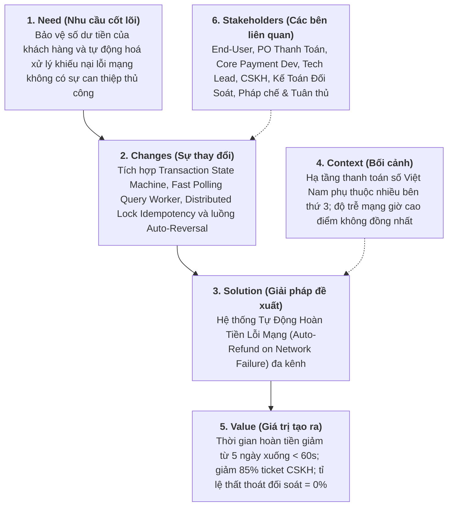
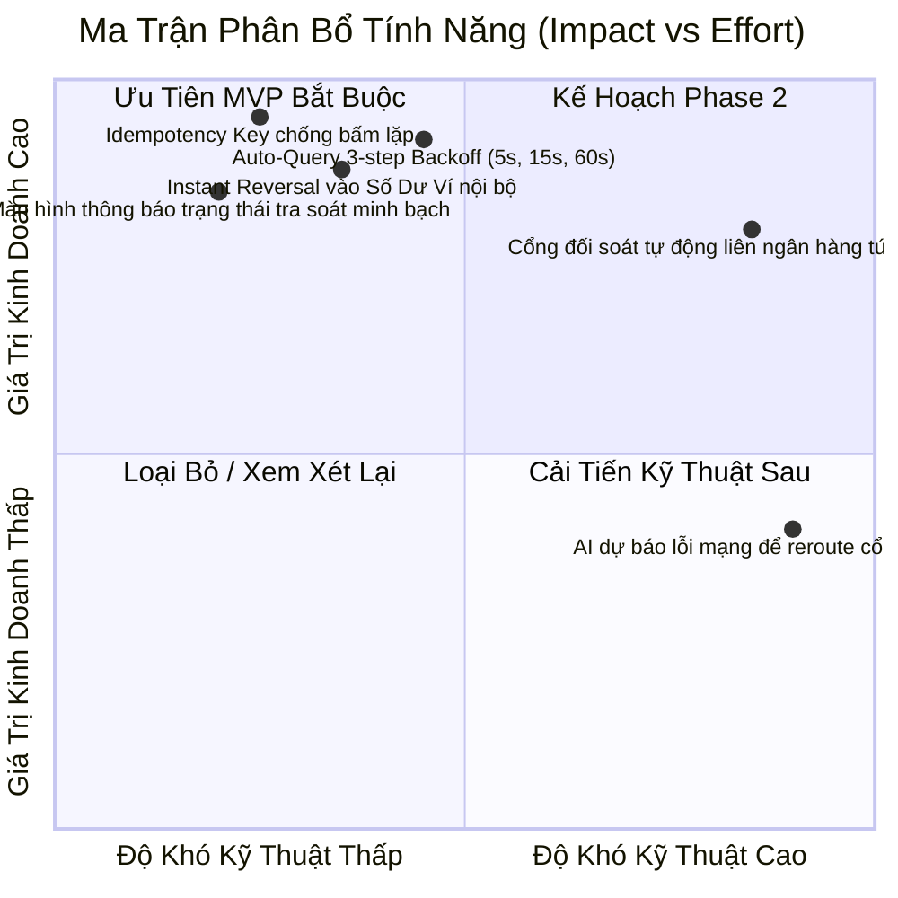

# [PHASE 1] Khởi Tạo & Định Hình Bài Toán (Discovery & Scoping)

**Initiative Name:** Tự Động Xử Lý Hoàn Tiền Khi Lỗi Mạng Thanh Toán (Payment Network Error Auto-Refund)  
**Slug:** `payment_network_error_refund`  
**Date:** 2026-09-13  
**Lead Author:** Principal AI Business Analyst & Lead Product Strategist  
**BABOK Knowledge Area:** Strategy Analysis & Business Analysis Planning  

---

## 1. Problem Statement (Áp dụng First Principles Thinking & 5W1H)

### 1.1. Bản chất bài toán (First Principles Analysis):
- **Hiện trạng bề nổi (Symptom):** Người dùng thực hiện thanh toán giao dịch (mua hàng, thanh toán hoá đơn, nạp thẻ). Màn hình ứng dụng xoay vòng (loading spinner) rồi báo lỗi: *"Mất kết nối mạng / Giao dịch thất bại"*. Tuy nhiên, tài khoản ngân hàng hoặc số dư ví của người dùng lại bị trừ tiền.
- **Phản ứng tiêu cực từ người dùng:**
  - Hoang mang, tức giận vì cảm giác bị "mất tiền oan".
  - Thao tác bấm lại nút thanh toán nhiều lần liên tiếp dẫn đến nguy cơ bị trừ tiền kép (Duplicate Deduction).
  - Gọi điện/chat tổng đài CSKH trong trạng thái bức xúc cao độ, thời gian giải quyết thủ công kéo dài 3 - 7 ngày làm việc.
- **Sự thật cốt lõi (Fundamental Truths):**
  1. **Bất đối xứng thông tin trong hệ thống phân tán (Distributed Network Asymmetry):**
     - Thanh toán số là giao dịch qua mạng giữa 3 thực thể độc lập: **Client (Mobile App/Web) ➔ Merchant Payment Service (Core BE) ➔ Payment Gateway / Acquirer Bank (PG/Napas)**.
     - Khi xảy ra ngắt kết nối mạng (Socket hang up, TCP Timeout, 504 Gateway Timeout), việc không nhận được phản hồi (No Response) **KHÔNG ĐỒNG NGHĨA** với việc giao dịch thất bại. Giao dịch có thể đã được trừ tiền thành công tại phía Ngân hàng, nhưng phản hồi (Response/Webhook) không quay trở về được hệ thống của chúng ta.
  2. **Tâm lý phòng vệ của khách hàng (Trust Deficit):** Tiền là tài sản nhạy cảm nhất. Mỗi giây trôi qua trong trạng thái *"Đã trừ tiền nhưng không nhận được dịch vụ/sản phẩm"* sẽ bào mòn lòng tin của khách hàng vào nền tảng với tốc độ luỹ thừa.
  3. **Chi phí ẩn của xử lý thủ công (Operational Overhead):** Mỗi ticket khiếu nại hoàn tiền thủ công tiêu tốn trung bình 35,000 - 50,000 VND chi phí nhân sự đối soát giữa CSKH, Vận hành và Kế toán, chưa kể rủi ro đối soát sai lệch.

### 1.2. Bảng 5W1H Chi Tiết:
| Khía cạnh | Nội dung phân tích chuyên sâu |
| :--- | :--- |
| **Who (Ai chịu ảnh hưởng)** | - **Khách hàng cuối (End-users):** Người dùng thanh toán qua Ví điện tử, Thẻ nội địa (Napas), Thẻ quốc tế (Visa/Mastercard), hoặc quét mã VietQR. - **Bộ phận Vận hành & CSKH (Tier 1 & Tier 2):** Bị quá tải bởi các cuộc gọi/ticket khiếu nại đòi hoàn tiền gấp. - **Bộ phận Tài chính & Đối soát (Finance Reconciliation):** Phải tra soát thủ công từng mã giao dịch (Trace ID/FT Code) với các ngân hàng đối tác. |
| **What (Vấn đề chính xác là gì)** | - Lỗi mạng (Client Network Drop, 499 Client Closed Request, 504 Gateway Timeout, Timeout khi gọi Cổng thanh toán) xảy ra ở thời điểm tiền đã rời khỏi tài khoản người dùng nhưng trạng thái đơn hàng trên hệ thống vẫn ghi nhận là `FAILED` hoặc `PENDING` vô thời hạn. - Thiếu cơ chế tự động truy vấn trạng thái (Query Status) và tự động hoàn tiền/đảo lệnh (Auto-Reversal / Auto-Refund) tức thì. |
| **Where (Xảy ra ở đâu)** | - Màn hình Checkout/Thanh toán trên ứng dụng Mobile (iOS, Android) và Web App. - Lớp Middleware kết nối giữa Payment Service nội bộ và Cổng thanh toán đối tác (Momo, VNPay, ZaloPay, Vietcombank, Napas, CyberSource). |
| **When (Xảy ra khi nào)** | - Khi người dùng di chuyển vào vùng sóng yếu (hầm gửi xe, thang máy, vùng phủ 4G chập chờn). - Trong các chiến dịch Flash Sale, Lễ Tết khi lưu lượng giao dịch tăng vọt khiến hệ thống Cổng thanh toán bên thứ 3 bị nghẽn (High Latency). |
| **Why (Tại sao cần giải quyết ngay)** | - Giữ chân người dùng (Retention): Biến trải nghiệm thất bại tiêu cực thành điểm chạm tin cậy (Delight Factor) khi hệ thống chủ động hoàn tiền minh bạch. - Cắt giảm 85% chi phí xử lý khiếu nại thủ công cho CSKH. - Triệt tiêu 100% rủi ro thất thoát đối soát (Reconciliation Drift) do hoàn nhầm hoặc chậm đối soát. |
| **How (Hiện trạng vs Tương lai)** | - *Hiện trạng (AS-IS):* User bị trừ tiền ➔ User tự phát hiện ➔ Gọi tổng đài khiếu nại ➔ CSKH tạo ticket Jira/Zendesk ➔ Đối soát tra mã ngân hàng (1 - 3 ngày) ➔ Kế toán duyệt lệnh hoàn thủ công (3 - 7 ngày). - *Tương lai (TO-BE):* Hệ thống tự phát hiện timeout ➔ Tự động truy vấn trạng thái đa tầng (Active Query) ➔ Tự động đảo lệnh/hoàn tiền trong 30 giây (Fast-path) hoặc tối đa 15 phút (Slow-path) ➔ Chủ động gửi thông báo xác nhận và giải trình minh bạch cho User. |

---

## 2. Khung BACCM (Business Analysis Core Concept Model)

Áp dụng mô hình chuẩn quốc tế của BABOK v3 để đánh giá toàn diện giá trị của sáng kiến:

---

## 3. Ma Trận RACI Các Bên Liên Quan (Stakeholder RACI Matrix)

| Nhóm / Vai trò | Trách nhiệm chính trong sáng kiến | RACI |
| :--- | :--- | :---: |
| **Product Owner (PO) - Payment Domain** | Định hình tiêu chí thành công của tính năng, chốt SLA hoàn tiền cho từng kênh thanh toán và duyệt chính sách hoàn tiền. | **A** (Accountable) |
| **Principal AI Business Analyst** | Phân tích bài toán, thiết kế Transaction State Machine, luồng ngoại lệ, API spec, INVEST stories và Gherkin AC. | **R** (Responsible) |
| **Solution Architect / Tech Lead** | Thiết kế giải pháp phân tán: Idempotency Key, hàng đợi RabbitMQ/Kafka cho Query Worker, Distributed Lock Redis, Circuit Breaker. | **C** (Consulted) |
| **Payment Backend Engineering Team** | Lập trình các service: Payment Gateway Adapter, Transaction Query Worker, Refund Service, Ledger Balance Service. | **R** (Responsible) |
| **Mobile & Frontend App Team** | Thiết kế giao diện xử lý timeout minh bạch (Friendly Error State, Status Tracking Screen, Anti-double-click protection). | **R** (Responsible) |
| **QA / Automation Test Lead** | Thiết kế kịch bản kiểm thử mô phỏng ngắt mạng hỗn loạn (Chaos Engineering: Drop packet, Network Latency, 504 Timeout). | **R** (Responsible) |
| **Đội Ngũ Đối Soát Tài Chính (Reconciliation Ops)** | Xác định quy tắc đối chiếu tệp giao dịch cuối ngày (Reconciliation EOD File) và tài khoản thanh toán treo (Suspense Account). | **C** (Consulted) |
| **Customer Support (CSKH / Helpdesk)** | Tiếp nhận đào tạo quy trình xem lịch sử tra soát tự động trên Portal Backoffice để hỗ trợ khách hàng nhanh chóng. | **I** (Informed) |
| **Legal & Compliance (Pháp chế & Tuân thủ)** | Kiểm tra tuân thủ thông tư Ngân hàng Nhà nước về quy định thời gian tra soát và hoàn tiền ví điện tử / thanh toán số. | **C** (Consulted) |

---

## 4. Ranh Giới Phạm Vi Dự Án (Scope Boundaries: MVP vs Future Phase)

### 4.1. Trong phạm vi phiên bản MVP (In-Scope - MVP Release):
1. **Bảo vệ phía Client (Client-Side Defense):**
   - Tạo mã định danh giao dịch duy nhất (`Idempotency-Key` / `Client-Request-ID`) trên mỗi lần bấm thanh toán.
   - Vô hiệu hoá nút thanh toán (Disable button & Loading Skeleton) ngay khi bấm, ngăn chặn double-click.
2. **Cơ chế Fast-Query Status Worker:**
   - Khi Backend gặp Timeout từ Cổng thanh toán (PG/Bank), hệ thống tự động đưa giao dịch vào hàng đợi truy vấn trạng thái với chu kỳ Exponential Backoff: `t = 5s`, `t = 15s`, `t = 60s`.
3. **Cơ chế Hoàn tiền / Đảo lệnh Tự Động (Auto-Reversal / Instant Refund):**
   - **Trường hợp A (Chưa trừ tiền tại PG):** Tự động gửi lệnh Huỷ/Void sang PG, mở khoá tài nguyên đơn hàng, thông báo người dùng thử lại an toàn.
   - **Trường hợp B (Đã trừ tiền tại Ví nội bộ nhưng lỗi gọi tiếp theo):** Hoàn tiền tức thì (Instant Balance Refund) vào Số dư ví trong vòng < 5 giây.
   - **Trường hợp C (Đã trừ tiền tại Thẻ liên kết / Ngân hàng ngoài nhưng timeout đơn hàng):** Tự động gọi API `refund_transaction` sang PG/Bank đối tác, trả mã biên nhận tra soát cho User.
4. **Màn hình thông báo & Tra cứu trạng thái minh bạch (In-Doubt State Screen):**
   - Nếu sau 60 giây chưa có kết quả cuối cùng từ Bank, màn hình không báo "Thất bại" mà hiển thị trạng thái *"Giao dịch đang được xác thực với ngân hàng"*, cam kết tự động hoàn tiền nếu trừ nhầm trong tối đa 15 phút, kèm mã tra soát trực quan.
5. **Backoffice Tra Soát Cho CSKH:**
   - Màn hình tra cứu lịch sử tự động xử lý lỗi mạng cho CSKH để giải đáp khách hàng ngay lập tức mà không cần chuyển sang phòng Kỹ thuật/Đối soát.

### 4.2. Ngoài phạm vi phiên bản MVP (Out-of-Scope - Phase 2 & Future):
1. Tự động chuyển cổng thanh toán thông minh theo thời gian thực (Smart Dynamic Routing with Circuit Breaker) khi phát hiện một cổng ngân hàng đang rớt mạng diện rộng.
2. Ứng trước số dư bồi thường (Instant Advance Credit) cho người dùng thẻ quốc tế trong thời gian chờ Ngân hàng phát hành xử lý tiền bồi hoàn (3-7 ngày).
3. Tích hợp AI Bot tự động gọi điện / gửi Zalo ZNS giải thích cho khách hàng khi phát hiện giao dịch treo.
