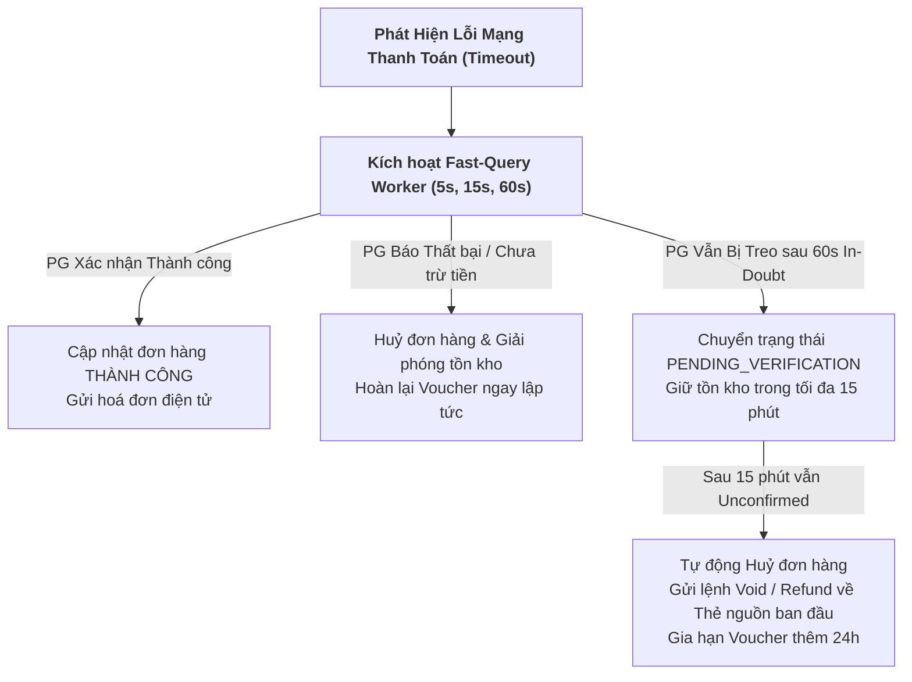

# [PHASE 2] Khai Thác & Làm Rõ Yêu Cầu (Elicitation & Collaboration)

**Initiative Name:** Tự Động Xử Lý Hoàn Tiền Khi Lỗi Mạng Thanh Toán (Payment Network Error Auto-Refund)  
**Slug:** `payment_network_error_refund`  
**Date:** 2026-09-13  
**Lead Author:** Principal AI Business Analyst & Lead Product Strategist  
**BABOK Knowledge Area:** Elicitation & Collaboration  

---

## 1. Ngân Hàng Câu Hỏi Khai Thác Đa Phòng Ban (Cross-Department Question Bank)

Nhằm đảm bảo không bỏ sót bất kỳ góc khuất nghiệp vụ nào, các câu hỏi khai thác được phân loại theo 4 lăng kính cốt lõi:

### 1.1. Góc nhìn Sản Phẩm & Trải Nghiệm Khách Hàng (Product & UX):
1. **Trạng thái giao diện khi timeout:** *Khi người dùng bị rớt mạng đúng lúc bấm thanh toán, nếu hiển thị chữ "Thanh toán thất bại" thì người dùng sẽ bấm lại ngay. Làm sao để thiết kế microcopy và visual status ngăn người dùng hoang mang mà vẫn giữ được sự trung thực?*
   - **Giải pháp:** Thiết kế màn hình chuyển tiếp: `"Đang xác thực giao dịch với ngân hàng (1/3)"`, thanh tiến trình đếm ngược và thông báo rõ: *"Vui lòng không bấm thanh toán lại để tránh bị trừ tiền hai lần. Chúng tôi cam kết hoàn tiền 100% nếu tài khoản của bạn bị trừ"*.
2. **Kênh thông báo chủ động (Proactive Notification):** *User không thể mở màn hình chờ mãi nếu mạng yếu, nếu user tắt app thì sao?*
   - **Giải pháp:** Khi hệ thống tự động hoàn tiền hoặc xác nhận giao dịch thành công trong background, tự động gửi đa kênh: **Push Notification ➔ In-app Notification Inbox ➔ SMS / Zalo ZNS (cho giao dịch giá trị cao > 1,000,000 VND)**.

### 1.2. Góc nhìn Kỹ Thuật, Kiến Trúc & An Ninh (Tech, Architecture & Security):
1. **Hiện tượng Race Condition (Cuộc đua trạng thái):** *Điều gì xảy ra nếu Worker Auto-Refund vừa gửi lệnh hoàn tiền qua PG, thì đúng 100ms sau Webhook từ PG báo "Giao dịch gốc thành công" mới bay tới hệ thống?*
   - **Giải pháp:** Áp dụng **Distributed Lock trên Redis** theo khoá `lock:txn:{order_id}`. Mọi thao tác thay đổi trạng thái (Webhook Handler, Query Worker, Refund Worker) đều phải giành được lock trước khi cập nhật `payment_transactions`. Nếu trạng thái đã chuyển sang `REFUND_INITIATED`, Webhook thành công sẽ bị từ chối cập nhật đơn hàng mà ghi nhận vào nhật ký kiểm toán (Audit Trail) để đối soát.
2. **Idempotency Key & Request De-duplication:** *Làm thế nào để chắc chắn lệnh Hoàn tiền (Refund API) gọi sang Cổng thanh toán không bị nhân bản (Duplicate Refund) nếu mạng giữa hệ thống ta và PG cũng bị chập chờn?*
   - **Giải pháp:** Mọi request hoàn tiền sang PG phải mang theo `refund_idempotency_key = hash(original_transaction_id + "_REFUND")`. Cổng thanh toán bắt buộc phải cam kết tính Idempotent: gọi 1 lần hay n lần đều chỉ trừ/hoàn 1 khoản duy nhất.

### 1.3. Góc nhìn Vận Hành & Đối Soát Tài Chính (Finance & Reconciliation Ops):
1. **Tài khoản treo (Suspense / Clearing Account):** *Số tiền hoàn được hạch toán như thế nào trong sổ cái kế toán (General Ledger) khi chưa có tệp đối soát cuối ngày từ ngân hàng?*
   - **Giải pháp:** Thiết lập tài khoản trung gian `SUSPENSE_PAYMENT_REVERSAL`. Khi phát lệnh hoàn, ghi nhận ghi Nợ/Có tạm tính; cuối ngày chạy job đối soát tự động (Reconciliation Batch Job lúc 02:00 AM) để khớp nối với tệp sao kê của Ngân hàng/PG.
2. **Phí giao dịch (MDR - Merchant Discount Rate) khi hoàn tiền:** *Khi giao dịch bị huỷ/hoàn tiền do lỗi mạng, phía ngân hàng/cổng thanh toán có thu phí MDR không?*
   - **Quy tắc:** Thống nhất hợp đồng với đối tác PG: Với giao dịch Auto-Reversal / Void trong ngày (hoàn ngay lập tức), hoàn 100% tiền gốc và miễn phí MDR.

### 1.4. Góc nhìn Pháp Chế & Tuân Thủ (Legal & Compliance):
1. **Thời hạn tra soát theo Thông tư Ngân hàng Nhà nước:** *Quy định pháp lý về việc hoàn tiền thẻ ngân hàng quy định thời gian tối đa là bao lâu?*
   - **Tuân thủ:** Theo Thông tư 19/2016/TT-NHNN và các văn bản sửa đổi, thời hạn xử lý tra soát khiếu nại không quá 30 - 45 ngày làm việc. Hệ thống của chúng ta cam kết tự động hoá ở mức **1 - 5 ngày làm việc** đối với thẻ, vượt xa tiêu chuẩn pháp lý bắt buộc.

---

## 2. Phân Tích Nghịch Đảo (Inversion Thinking & Pre-Mortem)

> **Kịch bản thảm hoạ (The Nightmare Scenario):**  
> *"Đợt khuyến mãi ngày đôi 11/11, Cổng thanh toán bị quá tải và phản hồi timeout 504 liên tục hàng ngàn request. Hệ thống kích hoạt Auto-Refund ồ ạt. Tuy nhiên, ngân hàng vẫn ghi nhận giao dịch ban đầu thành công và trừ tiền user. Hàng triệu đồng bị hoàn về ví/thẻ trong khi đơn hàng vẫn được giao cho khách. Công ty thất thoát 500 triệu đồng đối soát trong 2 tiếng; đồng thời hàng ngàn khách hàng khác bị trừ tiền 3 lần do bấm thanh toán liên tục. CSKH bị sập tổng đài."*

### Bảng Ma Trận Phòng Vệ Pre-Mortem (Defense-in-Depth Matrix):

| Điểm Lỗi Tiềm Tàng (Failure Mode) | Hệ Quả Thảm Hoạ (Severe Impact) | Biện Pháp Phòng Vệ Tiên Quyết (Mitigation Strategy) |
| :--- | :--- | :--- |
| **Bấm thanh toán lặp (Double-Click / Replay)** | User bị trừ tiền 2 - 3 lần liên tiếp cho cùng 1 giỏ hàng. | 1. Client vô hiệu hoá nút bấm và tạo `Idempotency-Key` cố định cho mỗi checkout session. 2. Backend áp dụng Redis Lock chặn mọi request trùng key trong vòng 60 giây. |
| **Hoàn tiền kép (Double-Dip / False Refund)** | Khách hàng nhận được cả hàng hoá và nhận lại tiền hoàn do lệch pha thời gian với Ngân hàng. | **Tuyệt đối không hoàn tiền khi chưa có xác nhận từ PG.** Bắt buộc trải qua chuỗi Fast-Query 3 bước. Chỉ hoàn tiền khi PG trả về mã lỗi rõ ràng hoặc sau khi đã gửi lệnh Huỷ (Void/Reversal) thành công sang PG. |
| **Mất mã đối soát (Trace ID Lost)** | Khi rớt mạng, Backend không kịp lưu mã `Gateway_Transaction_ID`, không biết tra soát với ai. | Mọi yêu cầu khởi tạo thanh toán phải lưu trạng thái `INITIATED` vào Database kèm `Merchant_Txn_Ref` **trước** khi gửi request sang Cổng thanh toán. Dùng chính mã này để tra cứu trạng thái. |
| **Kẻ xấu giả lập rớt mạng (Timeout Spoofing)** | Gian lận cố tình ngắt kết nối client để trục lợi khuyến mãi hoặc đòi bồi hoàn số dư. | Mọi quyết định hoàn tiền đều dựa trên Server-to-Server Verification giữa hệ thống và PG, không bao giờ tin cậy trạng thái do Client Mobile/Web tự báo lên. |

---

## 3. Grill BA Decision Log (Nhật Ký Quyết Định Nghiệp Vụ)

Các quyết định đã được chính thức phản biện (Grill) và chốt cùng Chuyên gia Nghiệp vụ:

### Quyết định 1: Kênh hoàn tiền cho giao dịch Thẻ Ngân hàng / Napas bị lỗi mạng
- **Bối cảnh:** Khi người dùng thanh toán qua Thẻ ATM, Thẻ tín dụng hoặc Napas QR bị trừ tiền nhưng mạng đứt.
- **Quyết định đã chốt:** **Phương án A (Original Payment Method)**.
  - Hoàn tiền tự động về đúng tài khoản ngân hàng / thẻ nguồn ban đầu thông qua API Refund của Cổng thanh toán.
  - Hiển thị công khai mã tham chiếu chuẩn tra soát ngân hàng (`Trace Code` / `FT Number`) trên ứng dụng.
  - Minh bạch thời gian xử lý: *"Tiền sẽ được ngân hàng hoàn về tài khoản từ 1 - 5 ngày làm việc theo quy định liên ngân hàng"*.
- **Lý do lựa chọn:** Tuân thủ quy định phòng chống rửa tiền (AML), tránh khiếu nại tại sao tiền thẻ bị ép nhận bằng số dư ví, đảm bảo sự an tâm tuyệt đối của khách hàng.

### Quyết định 2: Xử lý đơn hàng và tồn kho khi giao dịch bị treo (In-Doubt) sau 60 giây
- **Bối cảnh:** Sau 3 lần auto-query (60s) mà hệ thống Ngân hàng đối tác vẫn không phản hồi.
- **Quyết định đã chốt:** **Phương án 1 (Hold Order & Async Finalize trong 15 phút)**.
  - Đơn hàng được giữ ở trạng thái `PAYMENT_PENDING_VERIFICATION`.
  - Tạm giữ tồn kho (Stock Reservation) tối đa **15 phút**.
  - Worker nền tiếp tục quét định kỳ mỗi 3 phút một lần.
  - Nếu trong 15 phút Cổng thanh toán xác nhận thành công: Đơn hàng tự động chuyển sang `PAID` và tiến hành đóng gói.
  - Nếu sau 15 phút vẫn không có kết quả: Tự động huỷ đơn, nhả tồn kho cho khách khác, và kích hoạt lệnh huỷ/hoàn tiền sang Bank.
- **Lý do lựa chọn:** Tránh làm mất quyền mua hàng của khách trong lúc mạng chập chờn, đồng thời không khoá tồn kho quá lâu làm ảnh hưởng đến doanh số bán lẻ của nhà bán lẻ.

### Quyết định 3: Chính sách xử lý Voucher / Mã giảm giá đã áp dụng
- **Bối cảnh:** Khách hàng sử dụng voucher giảm giá giới hạn nhưng giao dịch bị lỗi mạng và huỷ bỏ.
- **Quyết định đã chốt:** **Phương án 1 (Instant Rollback + Auto-Extension 24h)**.
  - Khôi phục mã giảm giá (Voucher Rollback) về ví của khách hàng ngay lập tức khi đơn hàng bị huỷ.
  - Nếu mã giảm giá đó đã hết hạn trong thời gian giao dịch bị treo: Hệ thống tự động gia hạn thêm **24 giờ** tính từ thời điểm hoàn tất huỷ đơn.
- **Lý do lựa chọn:** Giữ chân khách hàng và tạo ấn tượng dịch vụ vượt trội (Customer Delight), loại bỏ hoàn toàn sự bức xúc khi "vừa mất tiền vừa mất voucher xịn".
