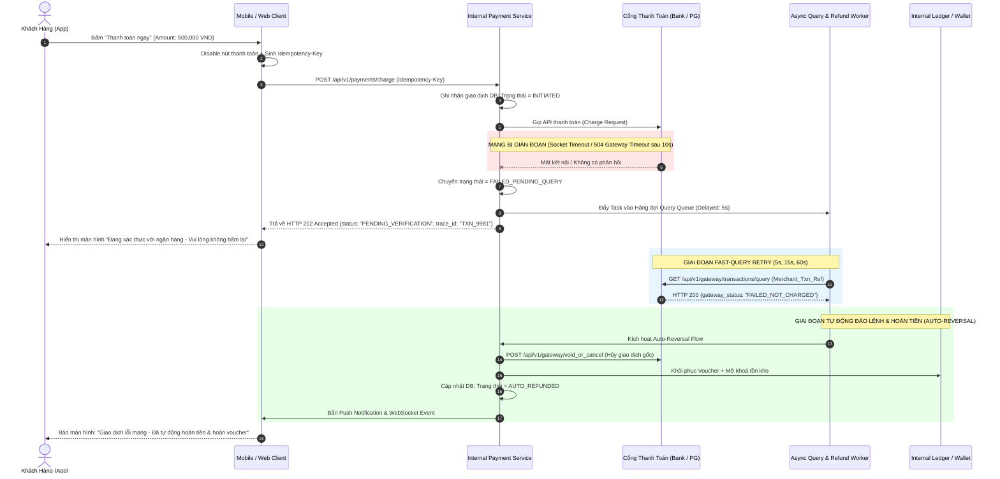
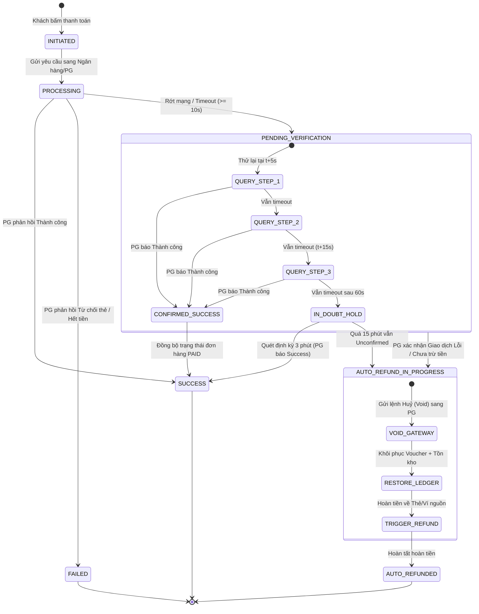

# [PHASE 3] Phân Tích & Đặc Tả Giải Pháp (Analysis & Modeling)

**Initiative Name:** Tự Động Xử Lý Hoàn Tiền Khi Lỗi Mạng Thanh Toán (Payment Network Error Auto-Refund)  
**Slug:** `payment_network_error_refund`  
**Date:** 2026-09-13  
**Lead Author:** Principal AI Business Analyst & Lead Product Strategist  
**BABOK Knowledge Area:** Requirements Analysis & Design Definition  

---

## 1. Giải Thích Logic Cốt Lõi Bằng Feynman Technique (ELI5 - Dành Cho Người Không Chuyên)

> **Ví dụ thực tế dễ hiểu:**  
> Hãy tưởng tượng bạn (Khách hàng) vào một quán phở và đưa 50,000 VND cho anh bồi bàn (Hệ thống thanh toán của chúng ta) để nhờ anh ấy mua cho bạn một ly nước mía ở quán nước đối diện (Cổng thanh toán Ngân hàng).  
> 
> Khi anh bồi bàn vừa cầm tiền băng qua đường, một chiếc xe tải chạy ngang qua che khuất tầm nhìn (Lỗi mạng Timeout). Bạn ngồi ở bàn không biết anh bồi bàn đã đưa tiền cho bà bán nước mía hay chưa, và cũng không thấy nước mía đâu.  
> 
> **Cách xử lý thông thường (Rất tệ):** Bạn tưởng mất tiền nên chạy đi mua ly khác (Bấm thanh toán lần 2 ➔ Mất thêm 50,000 VND). Khi anh bồi bàn quay lại, bạn bực bội đòi tiền.  
> 
> **Cách hệ thống mới của chúng ta xử lý (Chuẩn chỉnh):**  
> 1. Anh bồi bàn chủ động đứng đợi 5 giây, hỏi to sang quán nước: *"Chị đã nhận 50k chưa?"* (Fast-Query).  
> 2. Nếu bà bán nước bảo *"Nhận rồi và đã làm xong nước"*: Anh bồi bàn mang nước mía về cho bạn (Đơn hàng thành công).  
> 3. Nếu bà bán nước bảo *"Chưa nhận tiền, máy tính bị treo"*: Anh bồi bàn lập tức trả lại bạn tờ 50,000 VND kèm lời xin lỗi (Auto-Refund tức thì).  
> 4. Nếu bà bán nước vẫn chưa trả lời vì đông khách: Bạn được thông báo ngồi nghỉ uống trà đá miễn phí trong 15 phút, quán giữ chỗ cho bạn và cam kết sau 15 phút nếu không có nước mía sẽ trả lại tiền 100% kèm voucher giảm giá cho lần sau!

---

## 2. Sơ Đồ Luồng Nghiệp Vụ & Kiến Trúc (Process & Sequence Modeling)

### 2.1. Sơ đồ tuần tự xử lý lỗi mạng (Sequence Diagram):



---

### 2.2. Máy Trạng Thái Giao Dịch (Transaction State Machine Diagram):



---

## 3. Epics & User Stories (Chuẩn INVEST)

### Epic 1: Nhận Diện Lỗi Mạng & Truy Vấn Trạng Thái Tự Động (Auto-Detection & Polling)
- **Story 1.1 (Client Idempotency):**
  - *As a* Khách hàng thanh toán,
  - *I want* Hệ thống tự động khoá nút thanh toán và sinh mã yêu cầu duy nhất (Idempotency Key),
  - *So that* Tôi không bao giờ bị trừ tiền 2 lần khi mạng giật lag hoặc do tôi vô tình bấm đúp.
- **Story 1.2 (Active Query Worker):**
  - *As a* Hệ thống thanh toán,
  - *I want* Tự động kích hoạt hàng đợi truy vấn trạng thái sang Cổng thanh toán theo chu kỳ 5s, 15s, 60s khi gặp lỗi timeout,
  - *So that* Hệ thống tự xác định được giao dịch thực sự thành công hay thất bại mà không cần khách hàng can thiệp.

### Epic 2: Tự Động Đảo Lệnh & Hoàn Tiền (Instant Auto-Reversal & Refund)
- **Story 2.1 (Instant Void & Stock Release):**
  - *As a* Khách hàng bị lỗi mạng nhưng chưa bị trừ tiền ngân hàng,
  - *I want* Hệ thống tự động giải phóng tồn kho giỏ hàng và gửi lệnh huỷ đơn tức thì,
  - *So that* Tôi có thể tiến hành thanh toán lại đơn hàng ngay mà không bị báo hết hàng.
- **Story 2.2 (Original Source Refund Execution):**
  - *As a* Khách hàng bị trừ tiền thẻ ngân hàng nhưng đơn hàng bị lỗi mạng,
  - *I want* Hệ thống tự động gọi API hoàn tiền về thẻ của tôi và cấp mã tra soát ngân hàng rõ ràng,
  - *So that* Tôi an tâm tiền sẽ trở về tài khoản trong 1 - 5 ngày làm việc mà không cần gọi hotline cãi nhau với CSKH.

### Epic 3: Trải Nghiệm Khách Hàng & Thông Báo Minh Bạch (UX & Transparent Communication)
- **Story 3.1 (In-Doubt State Screen):**
  - *As a* Khách hàng có giao dịch thanh toán bị treo quá 60 giây,
  - *I want* Nhìn thấy màn hình giải thích rõ ràng trạng thái xác thực kèm đồng hồ đếm ngược 15 phút,
  - *So that* Tôi nắm được tiến độ xử lý và không sốt ruột.
- **Story 3.2 (Voucher Protection & Rollback):**
  - *As a* Khách hàng sử dụng voucher khuyến mãi cho đơn hàng bị lỗi thanh toán,
  - *I want* Voucher của tôi được trả lại ví ngay lập tức kèm thời hạn thêm 24 giờ nếu mã đã hết hạn,
  - *So that* Tôi không bị mất quyền lợi giảm giá do lỗi hạ tầng mạng.

---

## 4. Tiêu Chí Nghiệm Thu Acceptance Criteria (Chuẩn Gherkin)

### Scenario 1: Khách hàng bị lỗi mạng nhưng tiền chưa trừ ở ngân hàng (Fast-path Void)
```gherkin
Feature: Tự động đảo lệnh khi tiền chưa trừ tại Cổng thanh toán

  Scenario: Xử lý timeout khi Cổng thanh toán xác nhận chưa trừ tiền người dùng
    Given Khách hàng đang ở màn hình thanh toán đơn hàng "ORD_123" trị giá 300,000 VND
    And Khách hàng bấm nút "Thanh toán" sử dụng Thẻ ATM nội địa
    When Kết nối mạng giữa hệ thống và Cổng thanh toán bị timeout sau 10 giây
    Then Hệ thống chuyển trạng thái giao dịch sang "PENDING_VERIFICATION"
    And Màn hình ứng dụng hiển thị thông báo "Đang xác thực với ngân hàng..."
    And Worker tự động gọi API truy vấn trạng thái sau 5 giây
    And Cổng thanh toán trả về mã "TRANSACTION_NOT_FOUND" hoặc "NOT_CHARGED"
    Then Hệ thống kích hoạt lệnh huỷ đơn hàng "ORD_123"
    And Số lượng tồn kho sản phẩm được hoàn lại ngay lập tức
    And Voucher giảm giá được hoàn trả lại ví của khách hàng
    And Màn hình ứng dụng chuyển sang thông báo: "Giao dịch chưa trừ tiền. Bạn có thể thanh toán lại an toàn"
```

### Scenario 2: Khách hàng bị trừ tiền thẻ nhưng hệ thống bị timeout (Original Source Auto-Refund)
```gherkin
Feature: Tự động hoàn tiền về tài khoản nguồn khi tài khoản đã bị trừ tiền

  Scenario: Hoàn tiền thẻ ngân hàng tự động kèm cung cấp mã tra soát
    Given Khách hàng thực hiện thanh toán đơn hàng "ORD_456" trị giá 1,200,000 VND qua Thẻ Quốc Tế
    When Hệ thống bị timeout và sau 15 phút Cổng thanh toán vẫn không đồng bộ được đơn hàng
    Then Hệ thống tự động kích hoạt quy trình Auto-Refund
    And Hệ thống gửi request sang Cổng thanh toán gọi API "POST /refund" với Idempotency-Key duy nhất
    And Cổng thanh toán phản hồi HTTP 200 kèm mã hoàn tiền ngân hàng "REF_VN_88239"
    Then Trạng thái giao dịch cập nhật thành "AUTO_REFUNDED"
    And Hệ thống gửi Push Notification và SMS cho khách hàng với nội dung:
      "Giao dịch 1,200,000đ đơn ORD_456 gặp sự cố mạng đã được hoàn về thẻ nguồn. Mã tra soát ngân hàng: REF_VN_88239. Tiền sẽ về trong 1-5 ngày làm việc."
    And Khách hàng nhận lại voucher cũ với hạn sử dụng được cộng thêm 24 giờ
```

### Scenario 3: Chặn tấn công bấm liên tục (Double-Click Protection)
```gherkin
Feature: Phòng vệ Idempotency chống trừ tiền kép

  Scenario: Khách hàng cố tình bấm thanh toán 3 lần liên tiếp do sốt ruột
    Given Khách hàng bấm nút "Thanh toán" lần đầu tiên với Idempotency-Key "IDEMP_ABC_01"
    When Khách hàng tiếp tục bấm nút thanh toán lần thứ 2 và thứ 3 trong vòng 3 giây tiếp theo
    Then Client lập tức bỏ qua sự kiện click (Nút ở trạng thái disabled và hiển thị loading spinner)
    And Nếu có request bypass qua API gateway, Redis Distributed Lock phát hiện trùng "IDEMP_ABC_01"
    And API Gateway trả về HTTP 409 Conflict với thông điệp: "Giao dịch đang được xử lý, vui lòng chờ"
    And Tuyệt đối chỉ có 01 lệnh trừ tiền duy nhất được gửi sang Ngân hàng
```

---

## 5. Từ Điển Dữ Liệu (Data Dictionary & Schema Specification)

### 5.1. Bảng `payment_transactions` (Quản lý trạng thái giao dịch thanh toán)
| Tên Cột (Column) | Kiểu Dữ Liệu | Ràng Buộc (Constraints) | Ý Nghĩa Nghiệp Vụ |
| :--- | :--- | :--- | :--- |
| `transaction_id` | `VARCHAR(64)` | PRIMARY KEY | Định danh duy nhất của giao dịch nội bộ |
| `order_id` | `VARCHAR(64)` | NOT NULL, INDEX | Mã đơn hàng liên kết |
| `user_id` | `VARCHAR(64)` | NOT NULL, INDEX | Mã người dùng thanh toán |
| `amount` | `DECIMAL(15,2)` | NOT NULL, CHECK (>0) | Số tiền thanh toán (VND) |
| `payment_method` | `VARCHAR(32)` | NOT NULL | `WALLET`, `NAPAS_QR`, `CREDIT_CARD`, `DOMESTIC_CARD` |
| `idempotency_key` | `VARCHAR(128)` | UNIQUE, NOT NULL | Mã khoá ngăn chặn giao dịch trùng lặp |
| `status` | `VARCHAR(32)` | NOT NULL, INDEX | `INITIATED`, `PROCESSING`, `SUCCESS`, `FAILED`, `PENDING_VERIFICATION`, `AUTO_REFUND_IN_PROGRESS`, `AUTO_REFUNDED` |
| `gateway_provider` | `VARCHAR(32)` | NOT NULL | `VNPAY`, `MOMO`, `ZALOPAY`, `VIETCOMBANK` |
| `gateway_txn_ref` | `VARCHAR(128)` | NULLABLE | Mã tham chiếu sinh ra gửi sang PG |
| `gateway_trace_id` | `VARCHAR(128)` | NULLABLE | Mã giao dịch do Cổng thanh toán trả về |
| `query_retry_count` | `INT` | DEFAULT 0 | Số lần Worker đã truy vấn trạng thái (Tối đa 3 lần fast-query) |
| `in_doubt_hold_until`| `TIMESTAMP` | NULLABLE | Thời điểm hết hạn tạm giữ đơn hàng (t+15 phút) |
| `created_at` | `TIMESTAMP` | NOT NULL, DEFAULT NOW()| Thời điểm tạo giao dịch |
| `updated_at` | `TIMESTAMP` | NOT NULL | Thời điểm cập nhật cuối cùng |

### 5.2. Bảng `refund_audit_logs` (Nhật ký kiểm toán hoàn tiền tự động)
| Tên Cột (Column) | Kiểu Dữ Liệu | Ràng Buộc (Constraints) | Ý Nghĩa Nghiệp Vụ |
| :--- | :--- | :--- | :--- |
| `refund_id` | `VARCHAR(64)` | PRIMARY KEY | Định danh duy nhất của lệnh hoàn tiền |
| `transaction_id` | `VARCHAR(64)` | NOT NULL, FOREIGN KEY | Khoá ngoại tham chiếu `payment_transactions` |
| `refund_amount` | `DECIMAL(15,2)` | NOT NULL, CHECK (>0) | Số tiền thực tế hoàn lại cho người dùng |
| `refund_channel` | `VARCHAR(32)` | NOT NULL | `ORIGINAL_BANK_CARD`, `INTERNAL_WALLET` |
| `refund_reason` | `VARCHAR(64)` | NOT NULL | `NETWORK_TIMEOUT_AUTO_REVERSAL`, `IN_DOUBT_EXPIRED` |
| `gateway_refund_code`| `VARCHAR(128)` | NULLABLE | Mã biên nhận hoàn tiền từ phía Ngân hàng (FT / Ref Code) |
| `refund_status` | `VARCHAR(32)` | NOT NULL | `INITIATED`, `PROCESSING`, `SUCCESS`, `FAILED_MANUAL_REQUIRED` |
| `voucher_extended` | `BOOLEAN` | DEFAULT FALSE | Cờ đánh dấu voucher có được gia hạn 24h hay không |
| `created_at` | `TIMESTAMP` | NOT NULL, DEFAULT NOW()| Thời điểm kích hoạt lệnh hoàn tiền |

---

## 6. Đặc Tả API Hợp Đồng (API Contract Specifications)

### 6.1. API Truy Vấn & Đảo Lệnh Nền (Internal Worker Query Endpoint)
- **Endpoint:** `POST /api/v1/internal/payments/timeout-resolver`
- **Mô tả:** Được gọi bởi Message Queue Consumer khi giao dịch rơi vào trạng thái timeout.
- **Request Headers:**
  - `Content-Type: application/json`
  - `X-Internal-Service-Key: <HMAC_SECRET>`
- **Request Body:**
```json
{
  "transaction_id": "TXN_20260913_881920",
  "order_id": "ORD_VN_554910",
  "gateway_provider": "VNPAY",
  "timeout_detected_at": "2026-09-13T07:55:00Z",
  "retry_attempt": 1
}
```
- **Response Success (HTTP 200 OK - PG Báo Chưa Trừ Tiền -> Auto Reversal):**
```json
{
  "status": "SUCCESS",
  "data": {
    "transaction_id": "TXN_20260913_881920",
    "gateway_state": "TRANSACTION_NOT_FOUND",
    "action_taken": "AUTO_REVERSED",
    "order_status": "CANCELLED_SAFE",
    "stock_released": true,
    "voucher_rolled_back": true,
    "voucher_code": "DISCOUNT50K",
    "voucher_extended_until": "2026-09-14T07:55:00Z"
  }
}
```

### 6.2. API Khách Hàng Kiểm Tra Trạng Thái Đang Xác Thực (Client Polling Endpoint)
- **Endpoint:** `GET /api/v1/payments/{transaction_id}/verification-status`
- **Mô tả:** App Mobile gọi polling mỗi 3 giây khi đang ở màn hình đệm chờ kết quả.
- **Response In-Progress (HTTP 200 OK):**
```json
{
  "transaction_id": "TXN_20260913_881920",
  "order_id": "ORD_VN_554910",
  "status": "PENDING_VERIFICATION",
  "display_message": "Đang xác thực giao dịch với ngân hàng đối tác",
  "retry_step": "2/3",
  "hold_expires_in_seconds": 840,
  "support_reference_code": "TRACE_9921_VCB"
}
```
- **Response Auto-Refunded (HTTP 200 OK):**
```json
{
  "transaction_id": "TXN_20260913_881920",
  "order_id": "ORD_VN_554910",
  "status": "AUTO_REFUNDED",
  "display_message": "Giao dịch gặp sự cố mạng. Tiền đã được tự động hoàn về tài khoản nguồn.",
  "refund_details": {
    "refund_amount": 500000,
    "destination": "Thẻ tín dụng Vietcombank ****1234",
    "bank_trace_code": "FT2609139981245",
    "estimated_sla": "1-5 ngày làm việc",
    "voucher_restored": true
  }
}
```
