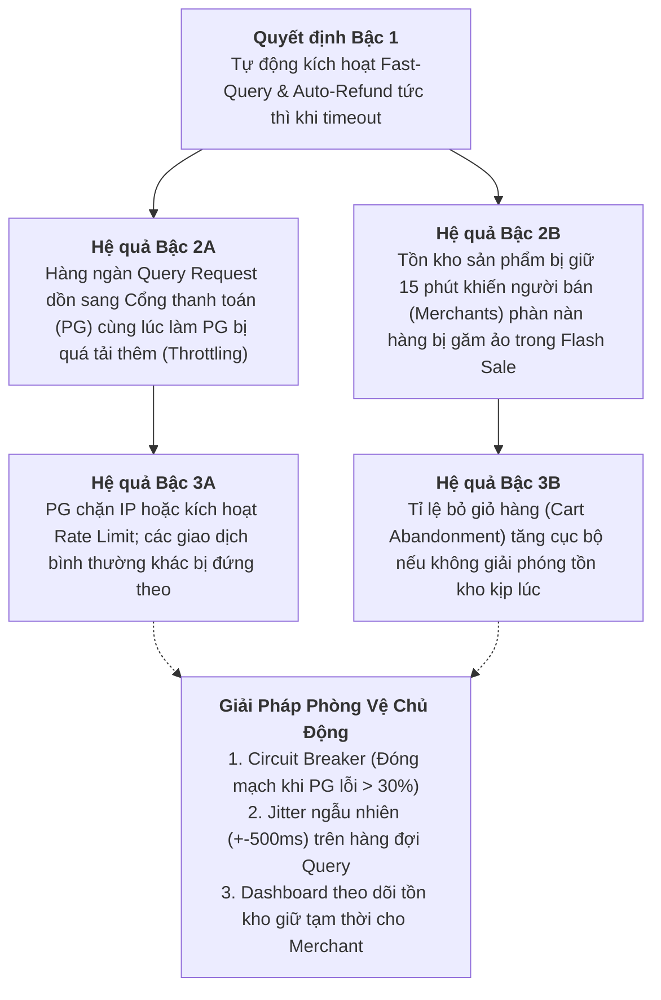

# [PHASE 4] Đồng Hành Triển Khai & Kiểm Thử (Delivery & Verification)

**Initiative Name:** Tự Động Xử Lý Hoàn Tiền Khi Lỗi Mạng Thanh Toán (Payment Network Error Auto-Refund)  
**Slug:** `payment_network_error_refund`  
**Date:** 2026-09-13  
**Lead Author:** Principal AI Business Analyst & Lead Product Strategist  
**BABOK Knowledge Area:** Requirements Life Cycle Management  

---

## 1. Phân Tích Hệ Quả Bậc 2 & Bậc 3 (2nd-Order & 3rd-Order Thinking)

Khi đưa tính năng Tự Động Hoàn Tiền Lỗi Mạng vào thực tế, hệ thống không hoạt động cô lập mà sẽ tạo ra các tác động dây chuyền:



- **Giải pháp kiểm soát rủi ro Bậc 2 & 3:**
  1. **Tích hợp Jitter vào Fast-Query:** Thay vì đúng 5s, 15s gửi request, hệ thống cộng thêm khoảng ngẫu nhiên $\pm 500\text{ms}$ để tránh hiện tượng đỉnh sóng truy vấn (Thundering Herd Problem).
  2. **Circuit Breaker cho từng Cổng Thanh Toán:** Nếu tỉ lệ timeout của Cổng VNPay/Momo vượt quá 30% trong 2 phút, hệ thống tự động tạm ẩn phương thức đó trên giao diện Checkout và khuyến nghị người dùng chọn phương thức thanh toán thay thế.

---

## 2. Phân Rã Sprint Backlog & Độ Ưu Tiên (MoSCoW Breakdown)

Các User Stories được phân chia nhỏ để đảm bảo hoàn thành trong 2 Sprints (Sprint cycle: 2 tuần, mỗi Story $\le 5$ Story Points):

| Mã Story | Tên User Story | Trọng Số (SP) | Ưu Tiên MoSCoW | Sprint Mục Tiêu |
| :--- | :--- | :---: | :---: | :---: |
| **ST-01** | Tạo Client Idempotency Key & Vô hiệu hoá nút thanh toán chống bấm lặp | **2 SP** | **Must Have** | Sprint 1 |
| **ST-02** | Xây dựng Transaction State Machine (`INITIATED` -> `PENDING_VERIFICATION` -> `AUTO_REFUNDED`) | **3 SP** | **Must Have** | Sprint 1 |
| **ST-03** | Phát triển Async Query Status Worker với chu kỳ Backoff (5s, 15s, 60s) | **5 SP** | **Must Have** | Sprint 1 |
| **ST-04** | Tích hợp Redis Distributed Lock chống Race Condition giữa Webhook và Auto-Refund | **3 SP** | **Must Have** | Sprint 1 |
| **ST-05** | Xây dựng luồng Instant Void & Auto-Refund về Thẻ nguồn qua Gateway API | **5 SP** | **Must Have** | Sprint 2 |
| **ST-06** | Logic hoàn trả Voucher (Rollback) & Tự động gia hạn +24h nếu voucher hết hạn | **2 SP** | **Should Have** | Sprint 2 |
| **ST-07** | Màn hình Mobile/Web hiển thị trạng thái đang tra soát minh bạch kèm đếm ngược | **3 SP** | **Should Have** | Sprint 2 |
| **ST-08** | Gửi thông báo đa kênh (Push Notification, SMS tra soát ngân hàng) khi hoàn tiền | **2 SP** | **Should Have** | Sprint 2 |
| **ST-09** | Portal Backoffice cho CSKH tra cứu lịch sử và mã FT/Trace ID của giao dịch lỗi mạng | **3 SP** | **Could Have** | Sprint 2 |
| **ST-10** | Smart Dynamic Routing tự chuyển cổng khi tỷ lệ lỗi mạng vượt ngưỡng (Phase 2) | **8 SP** | **Won't Have** | Future |

---

## 3. Ma Trận Kiểm Thử Biên & Giả Lập Lỗi (QA Edge Cases Matrix)

| ID | Tình Huống Kiểm Thử (Edge Case Scenario) | Hành Vi Hệ Thống Kỳ Vọng | Mức Độ Nghiêm Trọng |
| :--- | :--- | :--- | :---: |
| **TC-EDGE-01** | Người dùng tắt hẳn ứng dụng (Kill App) đúng thời điểm đang xoay vòng thanh toán. | Backend vẫn độc lập chạy tiếp. Transaction State Machine lưu `PENDING_VERIFICATION`. Worker tự động truy vấn PG. Nếu hoàn tiền thành công, gửi Push Notification báo cho user ngay khi mở lại app. | **Critical** |
| **TC-EDGE-02** | Race condition: Worker vừa gửi lệnh Auto-Refund sang PG thì Webhook báo `SUCCESS` từ PG bay về cùng thời điểm. | Redis Distributed Lock chỉ cho phép 1 tiến trình xử lý. Do trạng thái đã ghi nhận `AUTO_REFUND_IN_PROGRESS`, Webhook bị reject và ghi log cảnh báo đối soát. Không được phép giao hàng kép. | **Blocker** |
| **TC-EDGE-03** | Mạng bị rớt đúng lúc gọi API Hoàn tiền (`POST /refund`) sang Cổng thanh toán. | Lệnh hoàn tiền mang theo `refund_idempotency_key`. Worker thử lại theo Exponential Backoff tối đa 5 lần. Nếu vẫn lỗi, chuyển trạng thái `FAILED_MANUAL_REQUIRED` và cảnh báo lên kênh Slack trực của Ops. | **High** |
| **TC-EDGE-04** | Voucher giảm giá được áp dụng trên đơn hàng hết hạn lúc 23:59, giao dịch bị timeout lúc 23:58. | Hệ thống phát hiện voucher đã quá hạn lúc rollback. Tự động set thuộc tính `voucher_extended = true`, gia hạn đến 23:59 của ngày hôm sau. Khách hàng kiểm tra ví thấy voucher còn hiệu lực. | **Medium** |
| **TC-EDGE-05** | Khách hàng spam nút thanh toán 10 lần trong 1 giây qua công cụ tự động (Postman/Script). | API Gateway chặn từ request thứ 2 bằng mã lỗi `HTTP 409 Conflict` (Idempotency duplicate key). Không tạo thêm bản ghi giao dịch nào trong database. | **High** |

---

## 4. Kịch Bản Nghiệm Thu Người Dùng (UAT Test Scenarios)

### UAT-01: Kiểm tra luồng Fast-Path Auto Reversal khi Cổng thanh toán chưa trừ tiền
- **Người thực hiện:** QA Tester & PO.
- **Môi trường:** Staging / Sandbox Payment Gateway.
- **Các bước thực hiện:**
  1. Đăng nhập ứng dụng, thêm sản phẩm vào giỏ hàng trị giá 200,000 VND, áp dụng voucher `GIAM20K`.
  2. Tại màn hình chọn phương thức thanh toán, cấu hình Mock Gateway giả lập timeout 15 giây và trả về trạng thái `NOT_FOUND` khi được truy vấn.
  3. Bấm "Thanh toán ngay".
  4. Quan sát màn hình hiển thị trạng thái "Đang xác thực với ngân hàng".
  5. Trong vòng 15 giây, kiểm tra:
     - Màn hình chuyển sang thông báo: *"Giao dịch lỗi kết nối. Chưa trừ tiền tài khoản"*.
     - Đơn hàng bị huỷ an toàn.
     - Số lượng tồn kho sản phẩm trong kho trở về ban đầu.
     - Vào mục "Ví Voucher", mã `GIAM20K` đã sẵn sàng để sử dụng lại.

### UAT-02: Kiểm tra luồng Auto-Refund về Thẻ Nguồn & Cung Cấp Mã Tra Soát
- **Người thực hiện:** Lead BA & Đại diện Đối Soát Tài Chính.
- **Môi trường:** Staging tích hợp Ngân hàng thực nghiệm.
- **Các bước thực hiện:**
  1. Sử dụng thẻ Test VISA thanh toán đơn hàng 1,000,000 VND.
  2. Giả lập tình huống Cổng thanh toán trừ tiền thành công nhưng đường truyền Webhook về server bị đứt.
  3. Kiểm tra Worker tự động truy vấn và sau 15 phút (In-Doubt Expired) phát lệnh hoàn tiền `POST /refund`.
  4. Kiểm tra Database: Bảng `refund_audit_logs` có bản ghi chứa mã `gateway_refund_code`.
  5. Nhận tin nhắn thông báo trên điện thoại có chứa mã tham chiếu ngân hàng đầy đủ.

---

## 5. Khung Quản Lý Thay Đổi Nghiệp Vụ (Change Request - CR Protocol)

Mọi yêu cầu thay đổi logic (ví dụ: điều chỉnh thời gian giữ hàng 15 phút thành 30 phút, hoặc thay đổi kênh hoàn tiền) trong quá trình phát triển phải tuân thủ quy trình 3 bước:

```text
[CR Khởi Tạo] ➔ [Đánh Giá Tác Động Bởi BA & Tech Lead] ➔ [PO Phê Duyệt] ➔ [Cập Nhật Docs & Backlog]
```

- **Tiêu chí từ chối thay đổi (CR Reject Criteria):** Bất kỳ thay đổi nào làm suy giảm tính an toàn đối soát tài chính (ví dụ: bỏ qua Idempotency Key hoặc tự động hoàn tiền mà không có cơ chế khoá phân tán) sẽ bị bác bỏ ngay lập tức.
