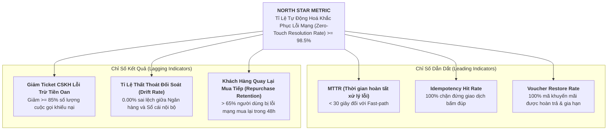

# [PHASE 5] Đánh Giá Sau Ra Mắt (Solution Evaluation)

**Initiative Name:** Tự Động Xử Lý Hoàn Tiền Khi Lỗi Mạng Thanh Toán (Payment Network Error Auto-Refund)  
**Slug:** `payment_network_error_refund`  
**Date:** 2026-09-13  
**Lead Author:** Principal AI Business Analyst & Lead Product Strategist  
**BABOK Knowledge Area:** Solution Evaluation  

---

## 1. Cây Chỉ Số Đánh Giá Hiệu Quả (Product Analytics Metrics Tree)

Áp dụng tư duy hệ thống (Systems Thinking) để gắn kết hiệu quả kỹ thuật của tính năng với mục tiêu kinh doanh chiến lược của công ty:



---

## 2. Khung Đo Lường Trải Nghiệm Khách Hàng (HEART Framework)

| Thành Tố (HEART) | Mục Tiêu Nghiệp Vụ (Goal) | Tín Hiệu Hành Vi (Signal) | Chỉ Số Đo Lường Cụ Thể (Metric) |
| :--- | :--- | :--- | :--- |
| **Happiness (Hài Lòng)** | Khách hàng không còn ức chế khi gặp sự cố mạng trong thanh toán. | Đánh giá khảo sát CSAT sau khi nhận thông báo hoàn tiền; điểm NPS tích cực. | **CSAT >= 4.6 / 5.0** đối với luồng tự động thông báo lỗi mạng. |
| **Engagement (Tương Tác)** | Người dùng đọc thông báo giải trình minh bạch và an tâm không spam gọi tổng đài. | Tỉ lệ mở thông báo Push Notification / SMS thông báo tra soát ngân hàng. | **Tỉ lệ xem chi tiết tra soát > 75%** khi có sự cố. |
| **Adoption (Sử Dụng)** | 100% các luồng thanh toán (Mobile App, Web, Mini-App) đều qua cơ chế Auto-Refund. | Số lượng giao dịch lỗi được chuyển tự động vào State Machine. | **Tỉ lệ bao phủ (Coverage) = 100%** tất cả các cổng thanh toán. |
| **Retention (Giữ Chân)** | Người dùng không bỏ app sau khi gặp lỗi thanh toán không mong muốn. | Khách hàng phát sinh giao dịch mới trong vòng 48 giờ kể từ lúc được hoàn tiền. | **Repurchase Rate >= 65%** trong 48 giờ. |
| **Task Success (Thành Công)** | Hoàn tiền chuẩn xác, không cần sự can thiệp của con người. | Lệnh hoàn tiền thành công ngay trong chu kỳ tự động. | **Zero-Touch Automation Rate >= 98.5%**; Tỉ lệ phải can thiệp thủ công < 1.5%. |

---

## 3. Đặc Tả Theo Dõi Phễu Hành Vi (Telemetry & Funnel Tracking Specs)

Mọi biến cố trong vòng đời xử lý lỗi mạng đều được bắn sự kiện về hệ thống Analytics (Mixpanel / Amplitude / BigQuery):

| Tên Sự Kiện (Event Name) | Điều Kiện Kích Hoạt (Trigger Point) | Tham Số Bắt Buộc (Event Properties) | Ngưỡng Cảnh Báo Bất Thường (Alert Threshold) |
| :--- | :--- | :--- | :--- |
| `payment_timeout_detected` | Khi request sang Cổng thanh toán vượt quá 10s không có response | `transaction_id`, `gateway_name`, `amount`, `payment_method`, `latency_ms` | Nếu > 50 events / phút ➔ Báo động sập mạng cổng thanh toán |
| `auto_query_attempted` | Mỗi lần Worker gửi lệnh truy vấn trạng thái (Lần 1, 2, 3) | `transaction_id`, `retry_count`, `elapsed_seconds`, `query_response_code` | Tỉ lệ truy vấn thất bại cả 3 lần > 5% ➔ Báo động kết nối API |
| `instant_reversal_succeeded` | Khi hệ thống huỷ đơn hàng và giải phóng tồn kho thành công (chưa trừ tiền) | `transaction_id`, `order_id`, `stock_released_items`, `voucher_extended_flag` | Tỉ lệ đảo lệnh thành công < 99% ➔ Cần kiểm tra logic DB |
| `auto_refund_completed` | Khi Cổng thanh toán phản hồi hoàn tiền thẻ ngân hàng thành công | `transaction_id`, `refund_amount`, `gateway_refund_code`, `destination_channel` | Thời gian từ lúc lỗi đến lúc hoàn > 15 phút ➔ SLA breach |
| `in_doubt_manual_escalated` | Khi quá 15 phút vẫn không thể xác thực trạng thái với Ngân hàng | `transaction_id`, `user_id`, `amount`, `error_diagnostic_log` | Bắn ngay Webhook vào kênh Slack PagerDuty của Ops Oncall |

---

## 4. Kế Hoạch Đánh Giá & Vận Hành Sau Ra Mắt (Post-Launch Evaluation Plan)

```text
[Go-Live Day 0] ➔ [Đánh Giá 7 Ngày (Day 7)] ➔ [Kiểm Toán Đối Soát 30 Ngày (Day 30)] ➔ [Tối Ưu Hoá Liên Tục]
```

### 4.1. Kế hoạch giám sát 7 ngày đầu tiên (Day 7 Health Check):
- **Tần suất theo dõi:** Giám sát thời gian thực trên Grafana Dashboard 24/7.
- **Trọng tâm kiểm tra:**
  1. Có bất kỳ giao dịch nào bị trừ tiền kép (Double-deduction) không? (Mục tiêu: 0 ca).
  2. Có bất kỳ trường hợp nào hoàn tiền nhầm cho đơn hàng đã giao (Double-dip) không? (Mục tiêu: 0 ca).
  3. Tỉ lệ phản hồi của tổng đài CSKH về chủ đề *"Mất tiền khi thanh toán"* có giảm ngay tuần đầu tiên hay không?

### 4.2. Kiểm toán đối soát tài chính 30 ngày (Day 30 Reconciliation Audit):
- **Phối hợp:** Đội ngũ BA, Tech Lead và Trưởng bộ phận Kế toán Đối soát.
- **Nội dung:** Rà soát toàn bộ số dư của tài khoản trung gian `SUSPENSE_PAYMENT_REVERSAL`. Đối chiếu 100% số lượng tiền hoàn trên hệ thống nội bộ với sao kê ngân hàng đối tác.
- **Đánh giá ROI:** Tính toán số giờ làm việc tiết kiệm được của nhân sự CSKH và Kế toán đối soát quy đổi ra chi phí thực tế.

### 4.3. Lắng nghe tiếng nói khách hàng (Voice of Customer - VoC):
- Tự động kích hoạt micro-survey trong app đối với những khách hàng vừa được hưởng cơ chế Auto-Refund:
  - *"Bạn có hài lòng với cách hệ thống xử lý sự cố mạng và hoàn tiền vừa qua không?"* (Đánh giá 1 - 5 sao).
  - Phân tích Text Mining các bình luận tiêu cực (nếu có) để tiếp tục tinh chỉnh microcopy và SLA thông báo.
