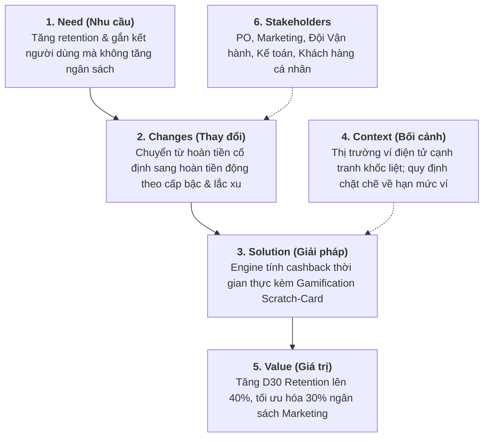

# [PHASE 1] Khởi Tạo & Định Hình Bài Toán (Discovery & Scoping)

**Initiative Name:** Ví Điện Tử Hoàn Tiền Động & Gamification (Dynamic Cashback & Gamification)  
**Slug:** `sample_e_wallet_cashback`  
**Date:** 2026-09-13  
**Lead Author:** Principal AI BA & Lead BA  
**BABOK Area:** Strategy Analysis & Business Analysis Planning  

---

## 1. Problem Statement (Áp dụng First Principles Thinking & 5W1H)

### Bản chất bài toán (First Principles Analysis):
- **Hiện trạng bề nổi:** Khách hàng phàn nàn tỷ lệ hoàn tiền cố định 1% quá nhàm chán, tỷ lệ quay lại thanh toán (Retention) tháng thứ 2 giảm từ 48% xuống còn 22%.
- **Bóc tách sự thật cốt lõi:** Người dùng không chỉ quan tâm đến giá trị tuyệt đối của số tiền, mà bị kích thích mạnh bởi **hiệu ứng phần thưởng bất ngờ (Variable Reward - B.F. Skinner hook model)** và cảm giác "săn được deal độc quyền". Chi phí Marketing 2 tỷ/tháng đang bị phân bổ cào bằng, không tạo được động lực cho nhóm khách hàng trung thành (High GMV).

### Bảng 5W1H chi tiết:
| Khía cạnh | Nội dung phân tích |
| :--- | :--- |
| **Who** | Nhóm người dùng cá nhân (Retail users) chi tiêu từ 500k - 5tr/tháng trên ví điện tử. |
| **What** | Tỷ lệ giao dịch lặp lại giảm sâu; chiến dịch hoàn tiền cố định đốt tiền nhưng không giữ chân được khách hàng. |
| **Where** | Luồng thanh toán quét mã QR (Dynamic QR) và nạp tiền điện thoại trên Mobile App (iOS & Android). |
| **When** | Xuất hiện rõ sau khi kết thúc đợt khuyến mãi chào mừng người dùng mới (Onboarding promo). |
| **Why** | Chi phí giữ chân khách hàng cũ (Retention Cost) rẻ hơn 5 lần so với chi phí tìm khách hàng mới (CAC). Nếu không khắc phục, GMV toàn ví sẽ giảm 18% trong Q4. |
| **How** | Hiện tại Marketing đang làm thủ công: xuất Excel danh sách user mỗi tuần rồi nạp voucher thủ công vào ví (tốn 40 giờ công/tháng, sai sót 3.2%). |

---

## 2. Khung BACCM (Business Analysis Core Concept Model)

---

## 3. Ma Trận RACI Các Bên Liên Quan (Stakeholder Matrix)

| Nhóm / Cá nhân | Chức vụ | Vai trò | RACI |
| :--- | :--- | :--- | :---: |
| Nguyễn Văn A | Head of Product | Bảo trợ dự án & duyệt ngân sách tổng | **A** |
| Trần Thị B | Lead Business Analyst | Chịu trách nhiệm bóc tách bài toán, điều phối spec | **R** |
| Lê Hoàng C | Tech Lead / Solution Architect | Thiết kế kiến trúc Engine tính cashback real-time | **C** |
| Đội ngũ Dev & QA | Squad Payments | Hiện thực hóa mã nguồn và kiểm thử | **R** |
| Phòng Marketing | Growth Lead | Cấu hình tỷ lệ hoàn tiền & chiến dịch | **C** |
| Phòng Kế toán / Đối soát | Finance Manager | Đối soát dòng tiền chiết khấu & trích lập quỹ | **C** |
| CSKH & Vận hành (Ops) | Operations Lead | Tiếp nhận sự cố & giải đáp thắc mắc người dùng | **I** |

---

## 4. Phạm Vi Triển Khai (Scope Boundaries: MVP vs Phase 2)

### In-Scope (MVP Phase 1 - 6 tuần):
1. **Dynamic Engine Rule v1**: Tự động tính tỷ lệ hoàn tiền ngẫu nhiên từ 1% đến 10% (tối đa 50,000 VND/giao dịch) dựa trên Hạng thành viên (Silver, Gold, Platinum).
2. **Interactive Scratch Card (Cào thẻ may mắn)**: Sau khi thanh toán thành công, hiển thị mini-animation cào thẻ nhận tiền thưởng vào ví điểm trong vòng < 500ms.
3. **Cơ chế chống gian lận cơ bản (Anti-Abuse)**: Giới hạn tối đa 3 lượt cào/ngày/user; kiểm tra Device ID và vị trí địa lý bất thường.

### Out-of-Scope (Dời sang Phase 2):
1. Tính năng "Đua bảng xếp hạng" (Leaderboard) theo tuần/tháng.
2. Tích hợp chia sẻ nhận thưởng qua mạng xã hội (Social referral).
3. Đổi điểm thưởng lấy hiện vật vật lý (Physical merchandise).
