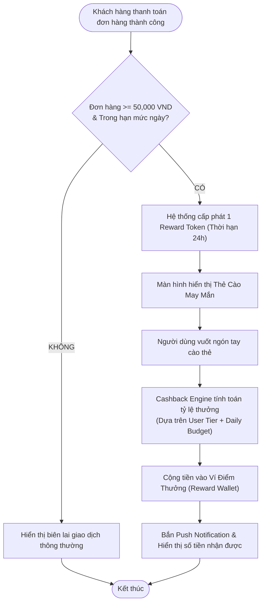
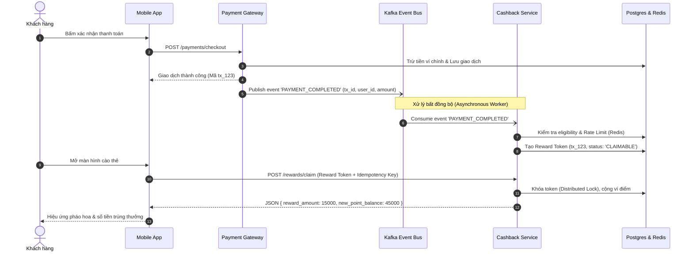

# [PHASE 3] Phân Tích & Đặc Tả Giải Pháp (Analysis & Modeling)

**Initiative Name:** Ví Điện Tử Hoàn Tiền Động & Gamification  
**Slug:** `sample_e_wallet_cashback`  
**Date:** 2026-09-13  
**BABOK Area:** Requirements Analysis and Design Definition (RADD)  

---

## 1. Sơ Đồ Luồng Xử Lý Nghiệp Vụ (Business Process Flow)

### 1.1. Luồng Người Dùng & Xử Lý Hệ Thống (End-to-End Flowchart)



### 1.2. Sơ Đồ Tuần Tự (Sequence Diagram - Tránh Nghẽn Hệ Thống)



---

## 2. Epics & User Stories (Chuẩn INVEST)

### Epic 1: Động Cơ Tính Thưởng & Cào Thẻ (Reward & Gamification Engine)

#### User Story US-CB-01: Cào thẻ nhận thưởng sau thanh toán
- **As a:** Người dùng ví điện tử đã hoàn tất thanh toán hợp lệ (>= 50,000 VND),
- **I want to:** Nhìn thấy thẻ cào may mắn và vuốt cào để mở phần thưởng,
- **So that:** Tôi nhận được tiền hoàn bất ngờ và cảm thấy hào hứng tiếp tục sử dụng ví.
- **Story Points:** 5 | **Priority (MoSCoW):** Must Have.

#### User Story US-CB-02: Cơ chế bảo vệ ngân sách tự động (Circuit Breaker)
- **As a:** Quản trị viên hệ thống (Admin / Risk Ops),
- **I want to:** Hệ thống tự động giới hạn tỷ lệ hoàn tiền khi tổng ngân sách chi trong ngày đạt ngưỡng 90%,
- **So that:** Tránh rủi ro thâm hụt tài chính của công ty.
- **Story Points:** 3 | **Priority (MoSCoW):** Must Have.

---

## 3. Tiêu Chí Chấp Nhận Chi Tiết (Acceptance Criteria - Gherkin Syntax)

### Scenario 1: Khách hàng đủ điều kiện nhận và cào thẻ thành công (Happy Path)
```gherkin
Given Khách hàng đang ở màn hình kết quả thanh toán
  And Giá trị thanh toán đơn hàng là 120,000 VND (hợp lệ >= 50,000 VND)
  And Số lượt nhận thưởng trong ngày của khách hàng là 1/3 (chưa vượt hạn mức 3 lượt)
 When Khách hàng vuốt ngón tay cào hết 70% bề mặt thẻ cào trên màn hình
 Then Hệ thống hiển thị số tiền thưởng nhận được (ví dụ: "Chúc mừng bạn nhận 8,500đ")
  And Số dư Ví Điểm của khách hàng tăng thêm đúng 8,500 VND trong vòng < 500ms
  And Giao diện xuất hiện nút "Dùng ngay" dẫn đến màn hình thanh toán hóa đơn
```

### Scenario 2: Xử lý rớt mạng khi đang cào thẻ (Thought Experiment / Edge Case)
```gherkin
Given Khách hàng đang thực hiện cào thẻ trên app
 When Mạng 4G/Wifi bị ngắt kết nối đột ngột
 Then Ứng dụng không làm mất lượt cào của khách hàng
  And Hiển thị pop-up: "Kết nối mạng gián đoạn. Thẻ cào đã được lưu an toàn trong mục 'Quà của tôi'"
  And Khi kết nối mạng phục hồi, khách hàng mở lại thẻ và tiếp tục cào bình thường
```

### Scenario 3: Chống gian lận spam request cào trùng lặp (Concurrency & Anti-Abuse)
```gherkin
Given Kẻ gian gửi 10 request API cào thưởng đồng thời trong 100ms bằng tool bot
 When Hệ thống tiếp nhận các request này
 Then Nhờ Redis Distributed Lock, chỉ DUY NHẤT request đầu tiên được xử lý và ghi nhận thưởng
  And 9 request còn lại bị từ chối với HTTP 409 Conflict: "Thẻ thưởng này đã được sử dụng"
```

---

## 4. Từ Điển Dữ Liệu (Data Dictionary)

| Bảng dữ liệu | Tên trường | Kiểu dữ liệu | Bắt buộc | Ràng buộc nghiệp vụ (Business Rules) |
| :--- | :--- | :--- | :---: | :--- |
| `rewards` | `id` | UUID | Có | Khóa chính |
| `rewards` | `user_id` | VARCHAR(36) | Có | Định danh khách hàng nhận thưởng |
| `rewards` | `transaction_id` | VARCHAR(64) | Có | Unique, liên kết với đơn hàng gốc |
| `rewards` | `reward_token` | VARCHAR(128) | Có | Token dùng 1 lần (Single-use JWT) |
| `rewards` | `amount` | DECIMAL(15,2) | Có | Giá trị thưởng (Min: 500đ, Max: 50,000đ) |
| `rewards` | `status` | ENUM | Có | `['PENDING', 'CLAIMED', 'EXPIRED']` |
| `rewards` | `expires_at` | TIMESTAMP | Có | Tự động hết hạn sau 24 giờ kể từ lúc cấp phát |

---

## 5. Đặc Tả Hợp Đồng API (API Contract Specification)

### Endpoint: `POST /api/v1/gamification/claim-reward`
- **Mục đích:** Khách hàng gửi lệnh cào mở thưởng.

#### Request Headers:
```http
Authorization: Bearer eyJhbGciOi...
X-Idempotency-Key: c9b2931a-6d45-4df0-9b88-8289417937d2
Content-Type: application/json
```

#### Request Body:
```json
{
  "reward_token": "rtk_9f81a7d8e204c82b7",
  "device_fingerprint": "a4f89c02e1b67812"
}
```

#### Response (HTTP 200 OK):
```json
{
  "code": "REWARD_CLAIMED_SUCCESS",
  "message": "Chúc mừng bạn đã nhận thưởng thành công!",
  "data": {
    "reward_amount": 12500,
    "reward_currency": "VND",
    "wallet_balance_updated": 42500,
    "claim_time": "2026-09-13T00:30:00Z",
    "remaining_claims_today": 1
  }
}
```
