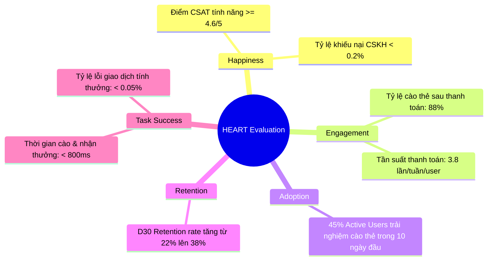

# [PHASE 5] Đánh Giá Sau Ra Mắt (Solution Evaluation)

**Initiative Name:** Ví Điện Tử Hoàn Tiền Động & Gamification  
**Slug:** `sample_e_wallet_cashback`  
**Date:** 2026-09-13  
**BABOK Area:** Solution Evaluation  

---

## 1. Cây Chỉ Số Sản Phẩm (Product Metrics Tree & HEART Framework)

### 1.1. North Star Metric (Chỉ số Định Hướng Cốt Lõi)
- **Chỉ số:** **Số lượng giao dịch thanh toán lặp lại hàng tháng (Monthly Repeat Transactions - MRT)**.
- **Kỳ vọng:** Tăng trưởng **+30%** sau 60 ngày triển khai tính năng hoàn tiền động.

### 1.2. Khung HEART Đánh Giá Toàn Diện

---

## 2. Đặc Tả Tracking Phễu Người Dùng (Product Analytics Funnel Specs)

| Bước Phễu | Event Name | Properties theo dõi | Tỷ lệ Drop-off mục tiêu |
| :--- | :--- | :--- | :---: |
| 1. Thanh toán thành công | `payment_success` | `order_id`, `amount`, `payment_method` | Baseline (100%) |
| 2. Xuất hiện thẻ cào | `reward_card_impressions` | `reward_token`, `user_tier`, `order_amount` | Drop-off < 3% |
| 3. Bắt đầu thao tác cào | `scratch_card_start` | `time_to_first_touch_ms` | Drop-off < 5% |
| 4. Hoàn tất cào thẻ | `scratch_card_completed` | `scratch_percentage`, `duration_seconds` | Drop-off < 2% |
| 5. Nhận tiền vào ví điểm | `reward_claimed_success` | `reward_amount`, `new_balance`, `engine_latency_ms` | Lỗi < 0.1% |

---

## 3. Lịch Trình Đánh Giá Sau Go-Live (Post-Release Evaluation Milestones)

- **Ngày D+1 (24h đầu):** Giám sát hạ tầng, kiểm tra lỗi crash app và tính toàn vẹn của số dư ví điểm. Đảm bảo P95 latency < 100ms.
- **Ngày D+7 (1 tuần):** Đánh giá sơ bộ tỷ lệ chuyển đổi phễu, kiểm tra xem có hiện tượng user gian lận spam đơn ảo không.
- **Ngày D+30 (1 tháng):** Phân tích tài chính chi tiết: So sánh tổng tiền hoàn thực tế so với ngân sách Marketing định mức (Budget Burn Rate). Đo lường mức tăng trưởng của D30 Retention.
- **Ngày D+90 (1 quý):** Tổ chức buổi tổng kết giải pháp (Solution Retrospective) cùng PO và Sếp để lên kế hoạch mở rộng sang Phase 2 (Leaderboard & Social sharing).
